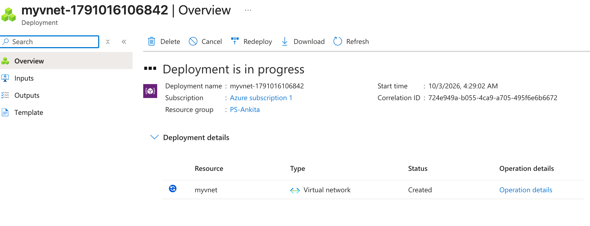
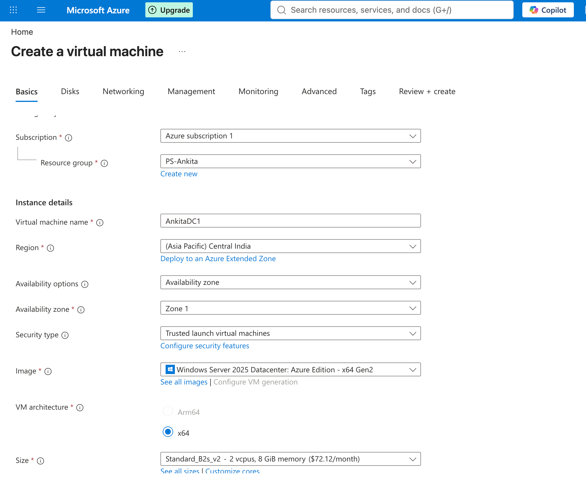
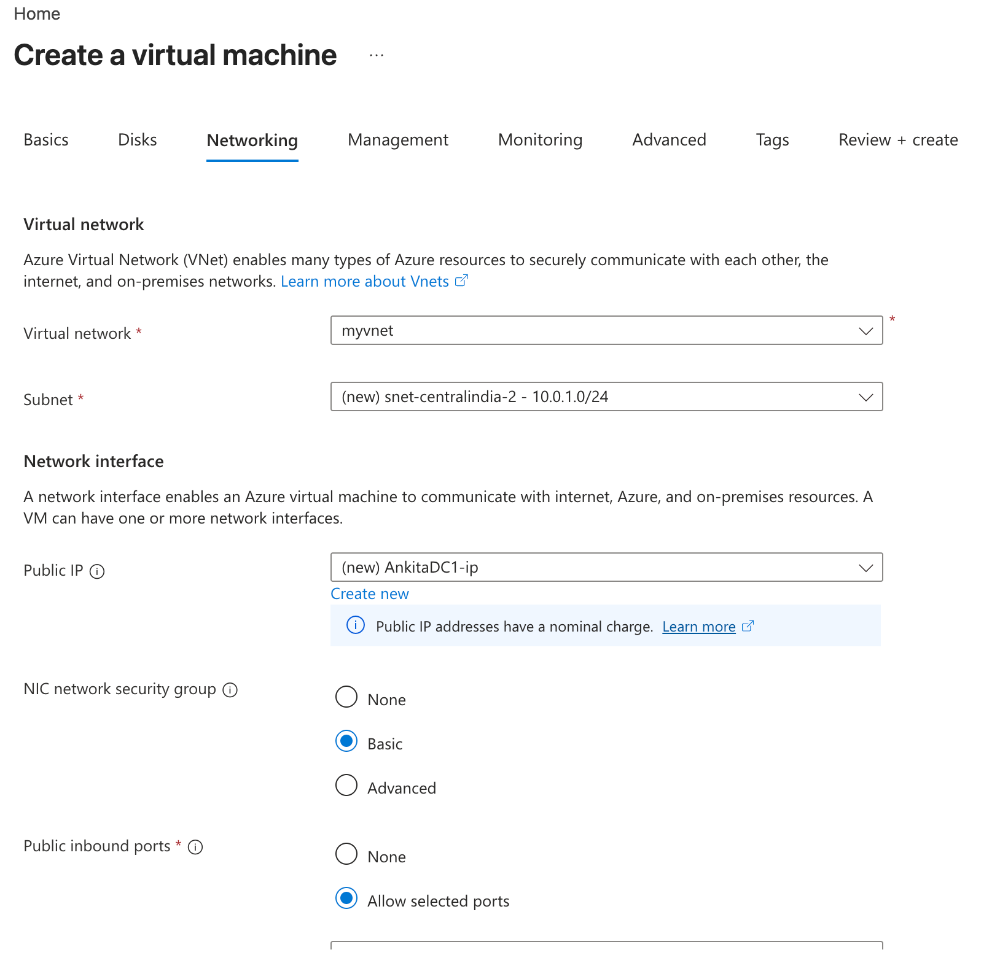
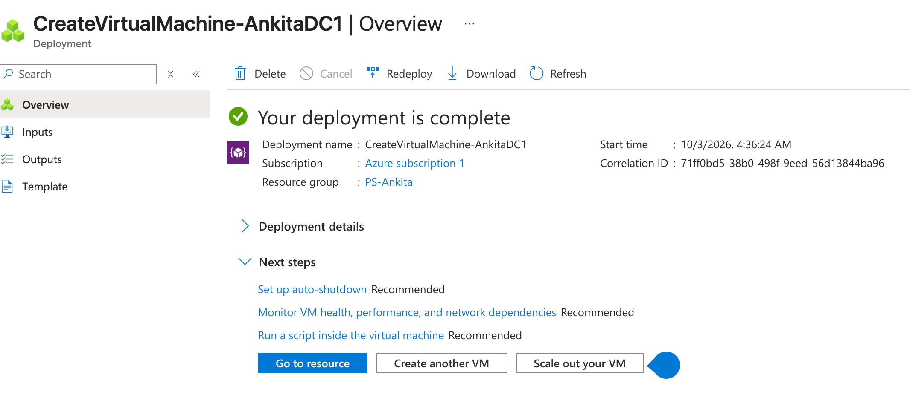

# Azure Windows Server 2025 VM Deployment

**Ankita Srivastava | Windows Server Administration Lab**

## Objective

Deploy a Windows Server 2025 virtual machine in Microsoft Azure and document the infrastructure choices visible in the Azure portal: resource group, virtual network, subnet, VM image, size, security type, public IP, network security group, and successful deployment.

## Lab configuration

| Component | Configuration shown in the lab |
| --- | --- |
| Subscription | `Azure subscription 1` |
| Resource group | `PS-Ankita` |
| Virtual network | `myvnet` |
| Subnet | `snet-centralindia-2` - `10.0.1.0/24` |
| VM name | `AnkitaDC1` |
| Region | Central India |
| Availability | Availability Zone 1 |
| Security type | Trusted launch virtual machines |
| Image | Windows Server 2025 Datacenter: Azure Edition - x64 Gen2 |
| Architecture | x64 |
| VM size | `Standard_B2s_v2` - 2 vCPUs, 8 GiB memory |
| Public IP | `AnkitaDC1-ip` |
| NIC network security group | Basic |

## 1. Create the virtual network

I created the Azure virtual network `myvnet` inside the `PS-Ankita` resource group. The deployment screen shows the virtual network resource being created successfully.

## 2. Configure the Windows Server virtual machine

On the **Basics** tab, I configured the VM as `AnkitaDC1` in Central India and selected Windows Server 2025 Datacenter: Azure Edition - x64 Gen2.

The VM size shown in the lab is `Standard_B2s_v2`, providing 2 vCPUs and 8 GiB of memory. The VM was also configured with Trusted Launch security and Availability Zone 1.

## 3. Configure Azure networking

On the **Networking** tab, I connected the VM to:

- Virtual network: `myvnet`
- Subnet: `snet-centralindia-2` (`10.0.1.0/24`)
- Public IP: `AnkitaDC1-ip`
- NIC network security group: Basic

I enabled **Allow selected ports**. My networking capture does not display the selected port number.

## 4. Verify deployment

Azure reported **Your deployment is complete** for `CreateVirtualMachine-AnkitaDC1` in the `PS-Ankita` resource group. This confirms that the VM deployment completed successfully.

## Skills demonstrated

- Azure resource group organization
- Azure Virtual Network and subnet selection
- Windows Server 2025 VM provisioning
- VM sizing and architecture selection
- Trusted Launch configuration
- Azure NIC, public IP, and network security group configuration
- Deployment verification in the Azure portal

## Next step

The next lab prepares `AnkitaDC1`, installs Active Directory Domain Services, creates the `ankita.com` forest, and promotes the server to the first domain controller.
