# Active Directory Domain Services - First Domain Controller

**Ankita Srivastava | Windows Server Administration Lab**

## Objective

Install Active Directory Domain Services on the Azure-hosted Windows Server 2025 VM, create the `ankita.com` forest, and promote `AnkitaDC1` to the first domain controller with DNS Server and Global Catalog enabled.

## Lab configuration

| Component | Configuration shown in the lab |
| --- | --- |
| Server | `AnkitaDC1` |
| Initial state | Workgroup member |
| AD DS deployment | New forest |
| Root domain | `ankita.com` |
| NetBIOS name | `ANKITA` |
| Forest functional level | Windows Server 2025 |
| Domain functional level | Windows Server 2025 |
| Global Catalog | Yes |
| DNS Server | Yes |
| DNS delegation | No |
| AD DS database path | `C:\\Windows\\NTDS` |
| AD DS log path | `C:\\Windows\\NTDS` |
| SYSVOL path | `C:\\Windows\\SYSVOL` |

## 1. Verify the server before promotion

Before installing AD DS, the Windows computer name was `AnkitaDC1` and the server was still in the `WORKGROUP` workgroup. Local Users and Groups also shows the local administrator account created for the VM.

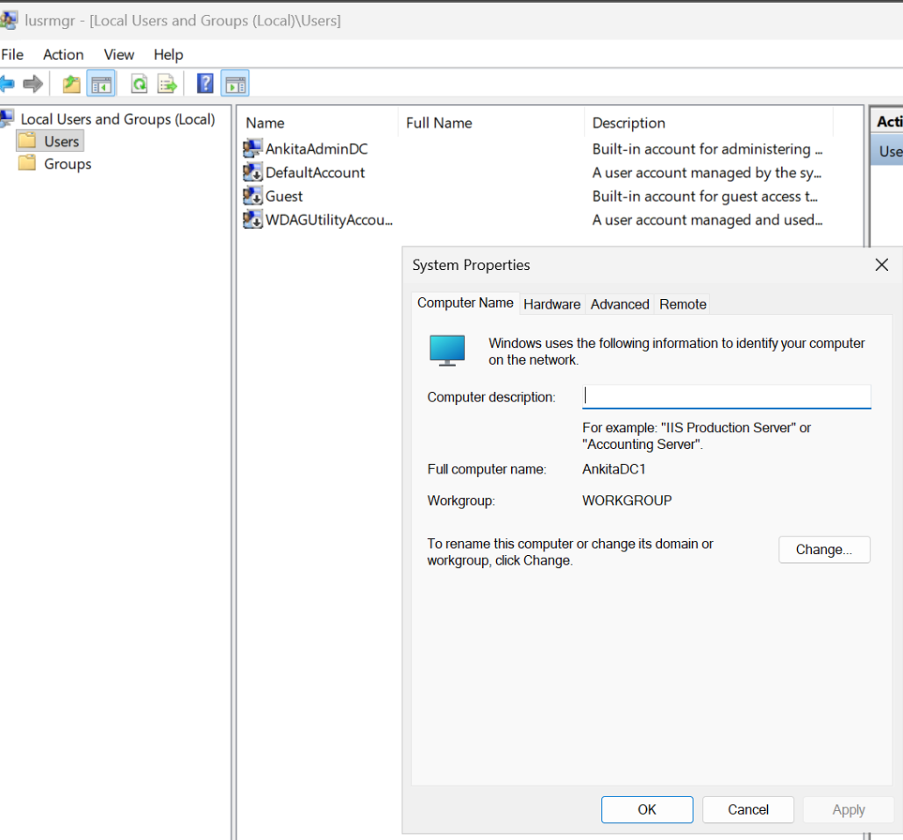

## 2. Start Add Roles and Features

From Server Manager, I launched **Add Roles and Features**. The wizard begins by reminding the administrator to verify prerequisites such as a strong Administrator password, network settings, and current Windows security updates.

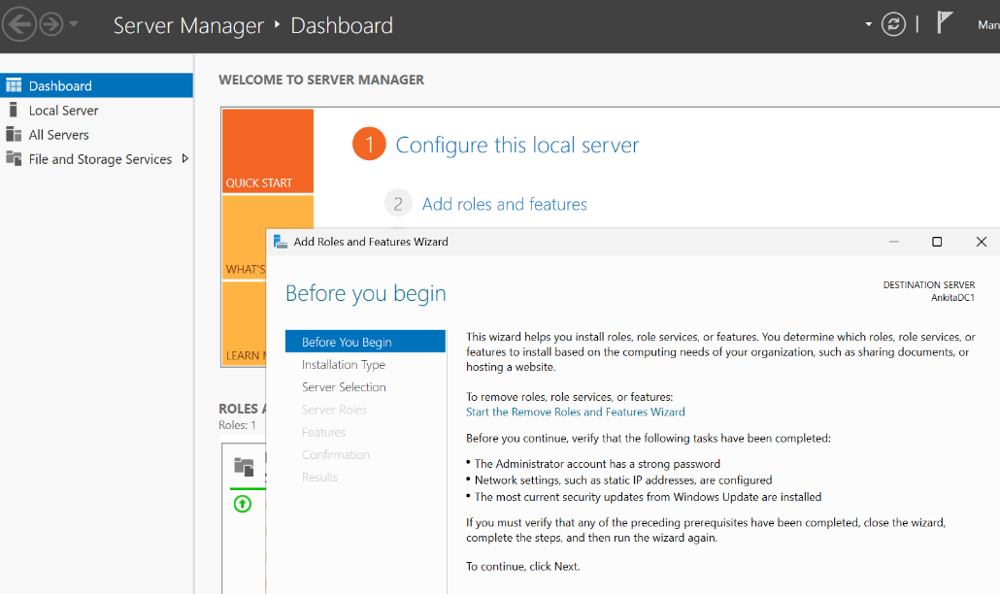

## 3. Choose role-based installation

I selected **Role-based or feature-based installation**, which is the appropriate path for adding AD DS to this Windows Server VM.

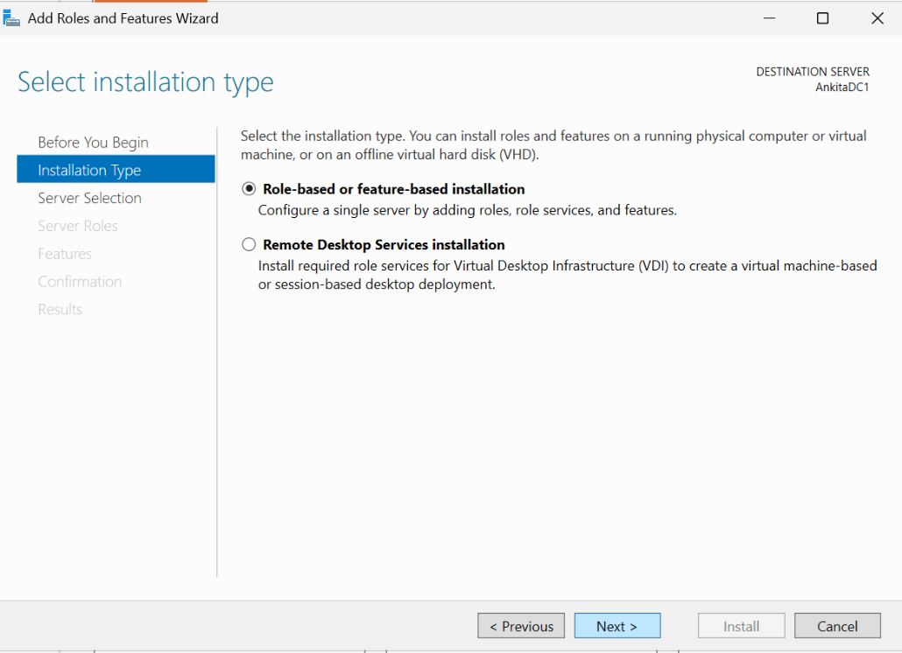

## 4. Select Active Directory Domain Services

I selected **Active Directory Domain Services**. Windows Server prompted to add the required management tools, including Group Policy Management, the Active Directory PowerShell module, Active Directory Administrative Center, and AD DS snap-ins and command-line tools.

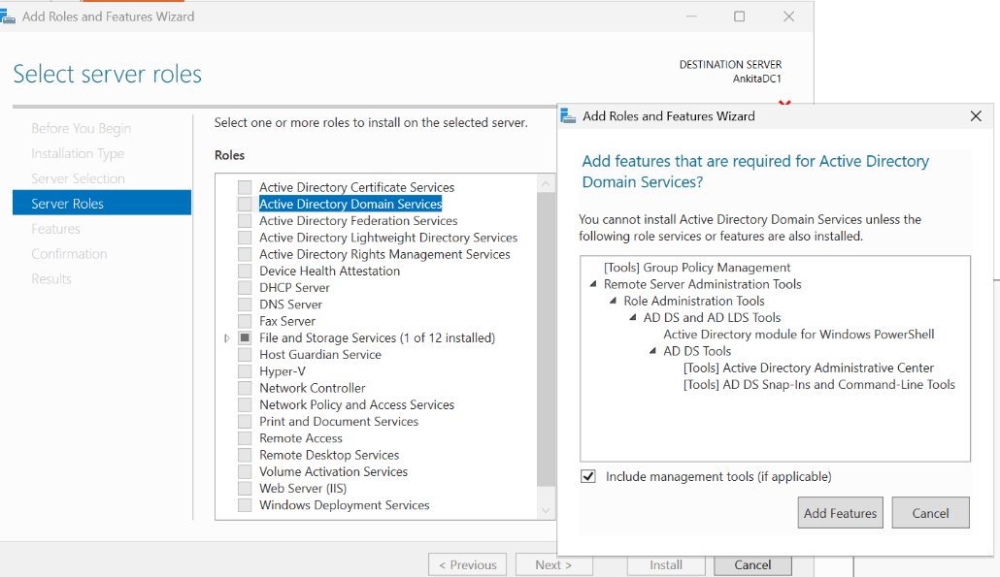

## 5. Install the AD DS role

The installation progress screen shows the AD DS role and supporting management components being installed on `AnkitaDC1`.

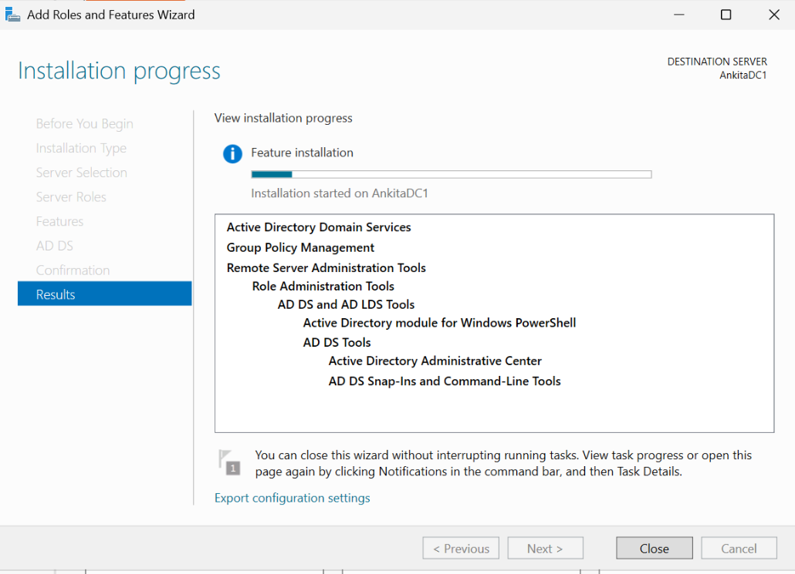

## 6. Begin domain-controller promotion

After the role installation completed, Server Manager displayed the post-deployment action **Promote this server to a domain controller**.

Installing the AD DS role installs the required binaries and tools; promotion is the step that configures the server as an actual domain controller.

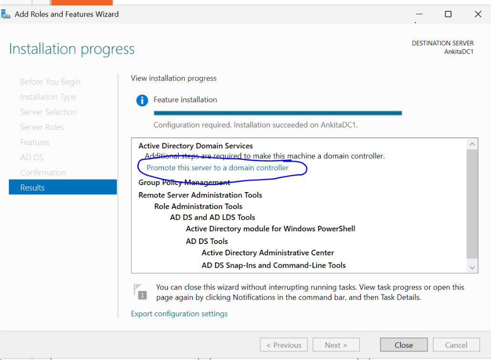

## 7. Create the `ankita.com` forest

Because this server is the first domain controller in the environment, I selected **Add a new forest** and entered `ankita.com` as the root domain name.

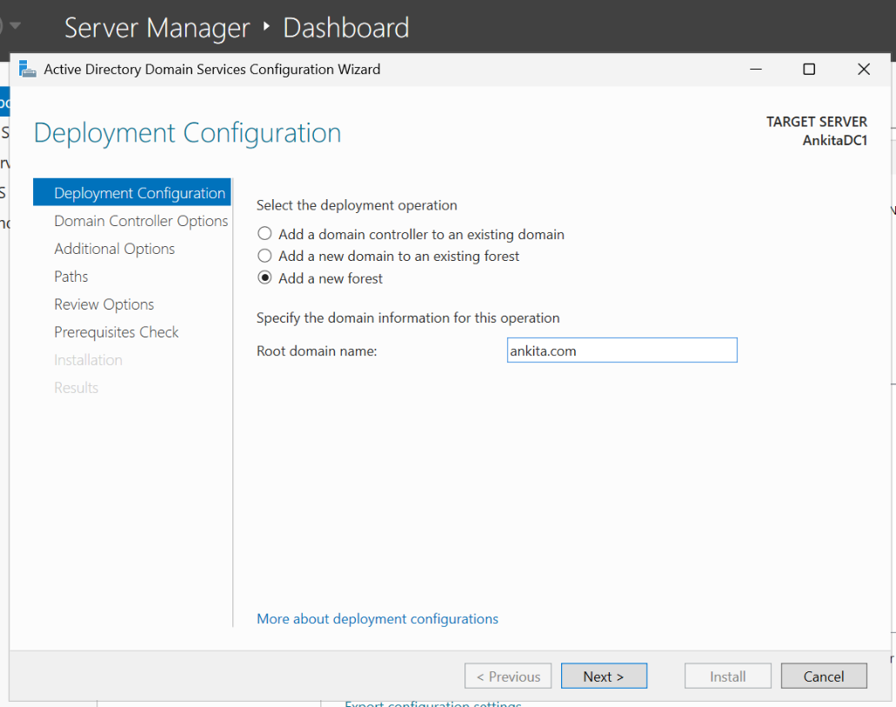

## 8. Verify the NetBIOS name

The wizard automatically assigned the NetBIOS domain name `ANKITA` for the `ankita.com` domain.

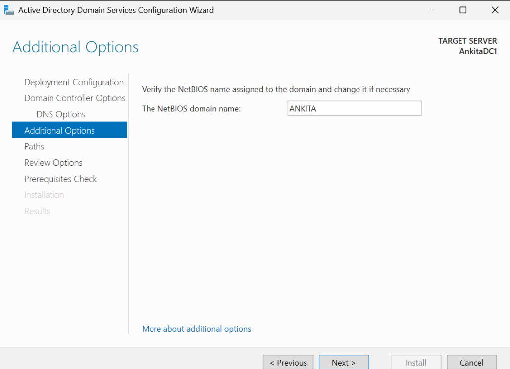

## 9. Keep the default AD DS paths

For this lab, I kept the default paths:

- Database folder: `C:\\Windows\\NTDS`
- Log files folder: `C:\\Windows\\NTDS`
- SYSVOL folder: `C:\\Windows\\SYSVOL`

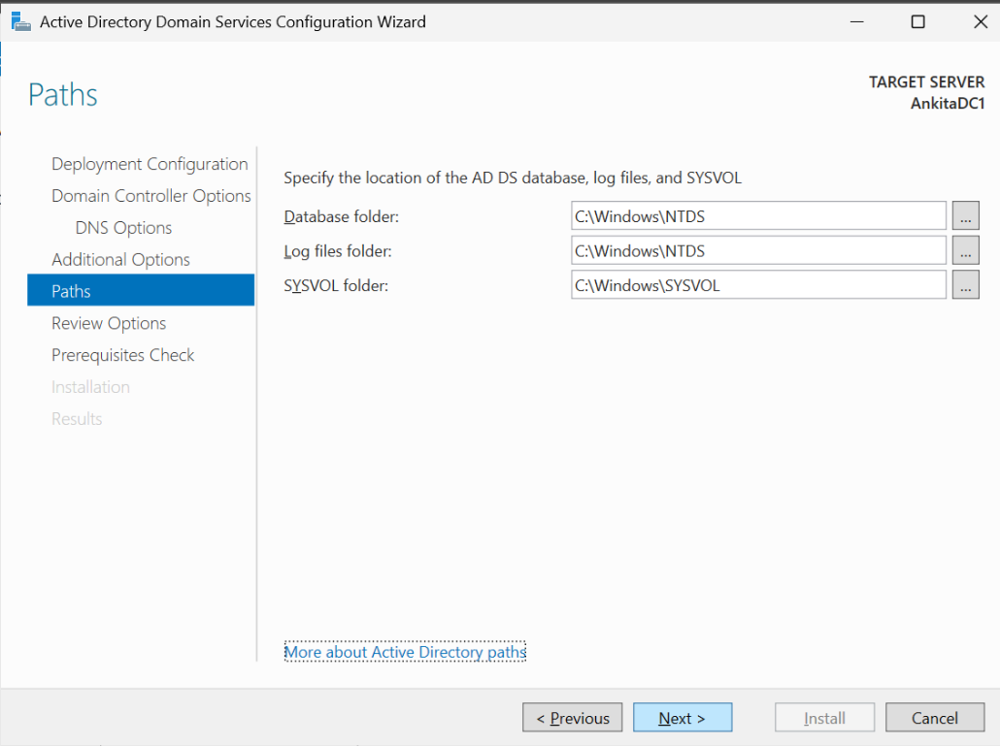

## 10. Review the promotion settings

The Review Options screen confirms that `AnkitaDC1` will become the first domain controller in the new `ankita.com` forest. It also shows:

- NetBIOS domain name: `ANKITA`
- Forest functional level: Windows Server 2025
- Domain functional level: Windows Server 2025
- Global Catalog: Yes
- DNS Server: Yes
- Create DNS Delegation: No

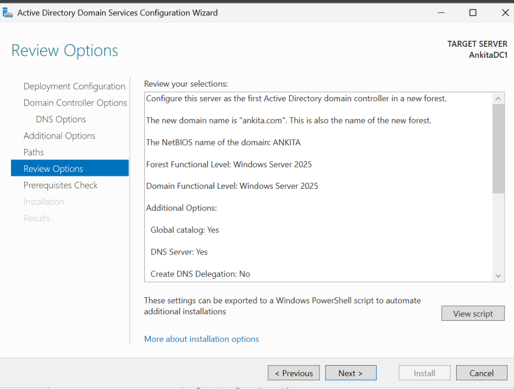

## 11. Verify Server Manager after promotion

After promotion, Server Manager shows **AD DS** and **DNS** as installed server roles on the server, alongside File and Storage Services.

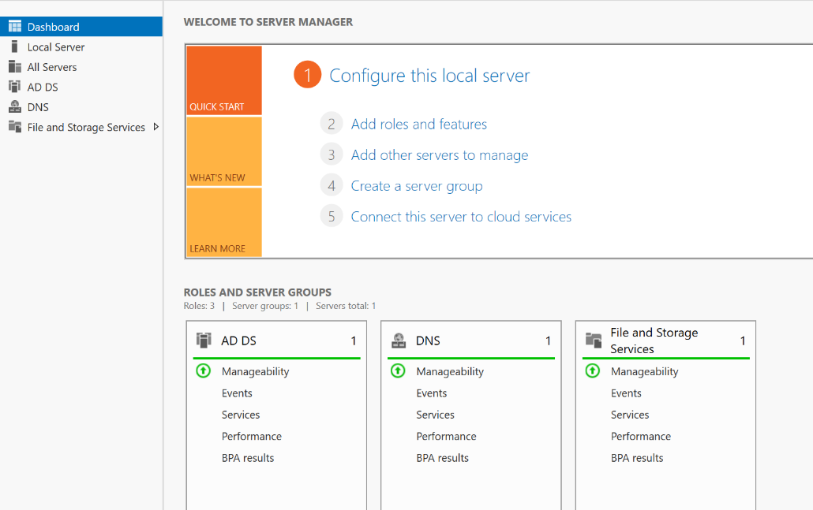

## What this lab demonstrates

- Difference between installing the AD DS role and promoting a domain controller
- New Active Directory forest creation
- Root-domain naming
- NetBIOS domain naming
- Windows Server 2025 forest and domain functional levels
- DNS Server and Global Catalog configuration
- NTDS database/log locations and SYSVOL location
- Server Manager verification after promotion

## Documentation coverage

I documented the AD DS installation, new-forest configuration, promotion settings, and Server Manager view after promotion. This walkthrough does not include captures of the DSRM-password page or prerequisite-check results, or outputs from command-line health checks, FSMO verification, and DNS record verification.
