# NTFS and Share Permissions

My notes and lab practice for controlling access to shared folders with Active Directory security groups, NTFS permissions, and SMB share permissions.

[Download the PDF notes](NTFS_Permissions.pdf)

## Windows file systems

- **FAT/FAT32/exFAT:** useful for portable storage and compatibility. They do not provide NTFS-style file permissions, EFS, or NTFS compression. FAT32 has a 4 GB file-size limit.
- **NTFS:** the standard Windows OS file system. Supports file and folder permissions, auditing, EFS encryption, and compression. Auditing requires an audit policy and appropriate auditing entries on the object.
- **EFS:** decryption requires the relevant private key. A configured recovery agent with the recovery private key can recover data; domain administrator membership alone does not guarantee decryption.
- **ReFS:** designed for resilient data storage, including Storage Spaces and virtualization workloads. Supports access control and integrity features; repair depends on the deployment and available redundant data. It cannot host the Windows boot volume and does not provide every NTFS feature.

## Shared folders and SMB

A central shared folder lets authorized users collaborate and makes access control and backup easier to manage. Windows SMB file sharing normally uses **TCP 445**.

In this lab, the domain controller also hosts the Data share. The folder is `C:\Data`; its share name is `Data`.

A UNC path has the format `\\ServerName\ShareName`. For example, `\\AnkitaDC1\Data` uses the server name from my domain lab; substitute the actual file server name when connecting. `\\ServerName` lists available shares. Network access also requires working name resolution, connectivity, and firewall rules.

`SYSVOL` distributes domain Group Policy files and scripts; `NETLOGON` exposes the domain logon-script location.

## Create users and the IT Team security group

I use the `ankita.com` domain and `ANKITA` NetBIOS name.

1. Open Active Directory Users and Computers with `dsa.msc`.
2. Create user1 and user2 in the intended container or OU.
3. Create **IT Team** with **Global** scope and **Security** type.
4. Open the group, select **Members**, click **Add**, and resolve user1 and user2 with **Check Names**.
5. Confirm membership through the group's **Members** tab or each user's **Member Of** tab.

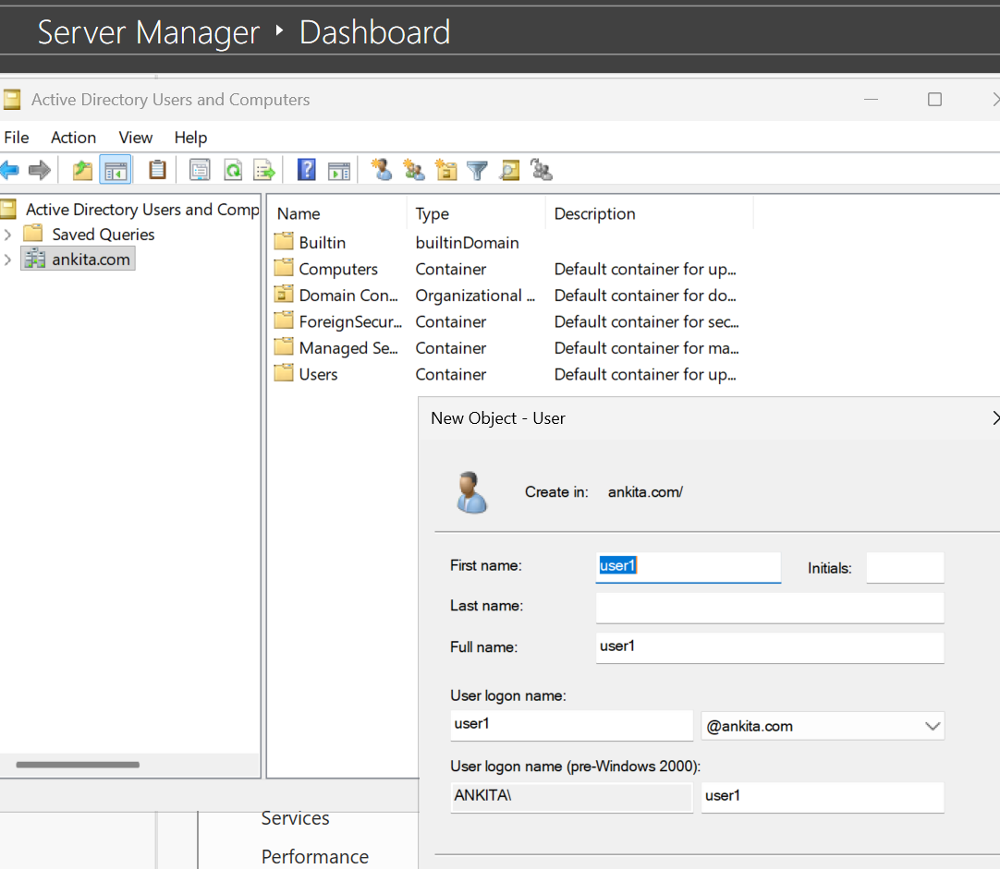

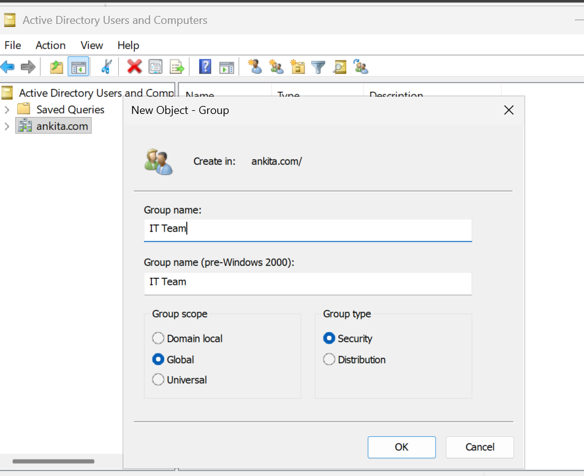

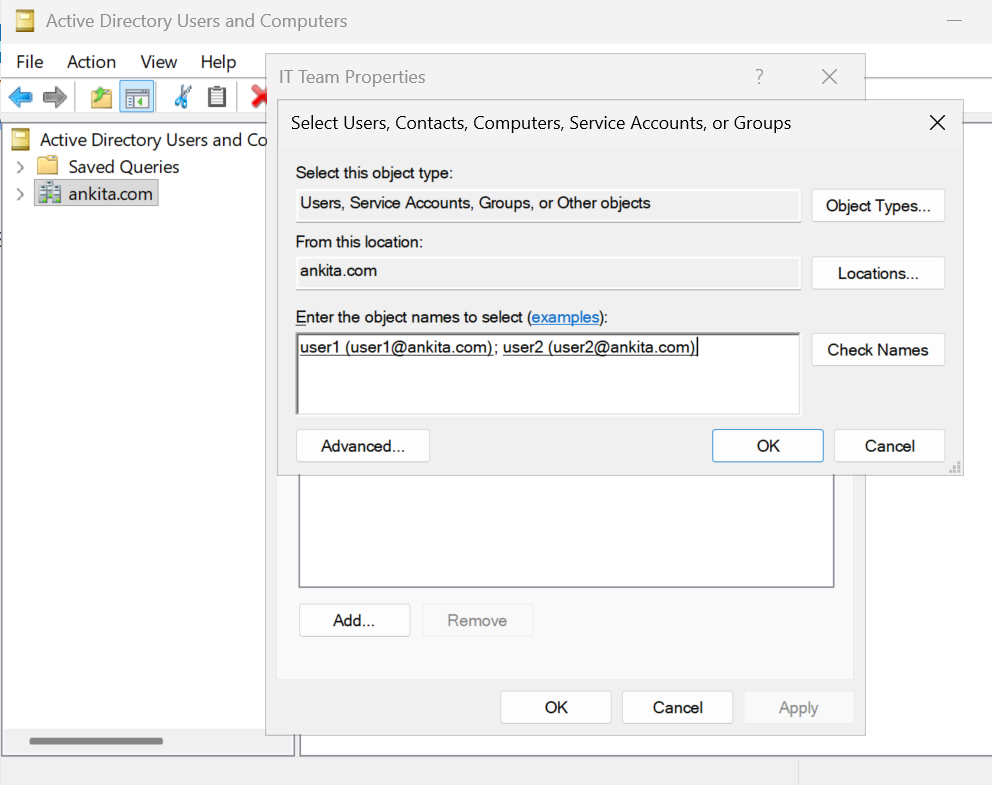

Assigning permissions to a group makes access easier to maintain. When another IT employee needs access, add their account to the group. Existing sign-in sessions may need refreshing after membership changes.

## Create and share C:\Data

1. Create the **Data** folder under `C:\`.
2. Open **Data Properties > Sharing > Advanced Sharing**.
3. Select **Share this folder**, with share name **Data**.
4. Open **Permissions**, grant **Everyone: Full Control**, and apply the settings.

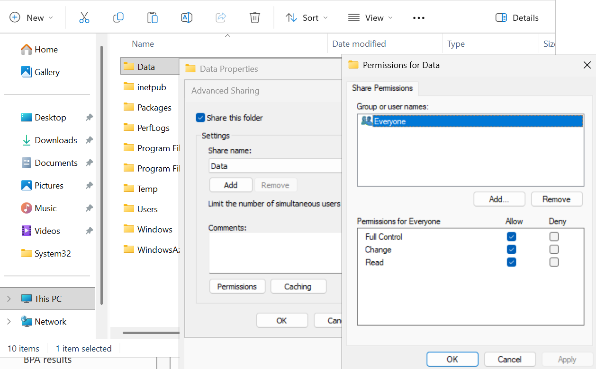

Open the properties of **Data**, rather than changing permissions on the entire C: drive. In this lab, share-level Full Control permits requests through the share; NTFS restricts access to the intended group. This is a lab configuration, and share permissions can also be restricted to specific groups.

## Configure NTFS permissions

Open **Data Properties > Security**. The initial entries include Authenticated Users, SYSTEM, Administrators, and Users.

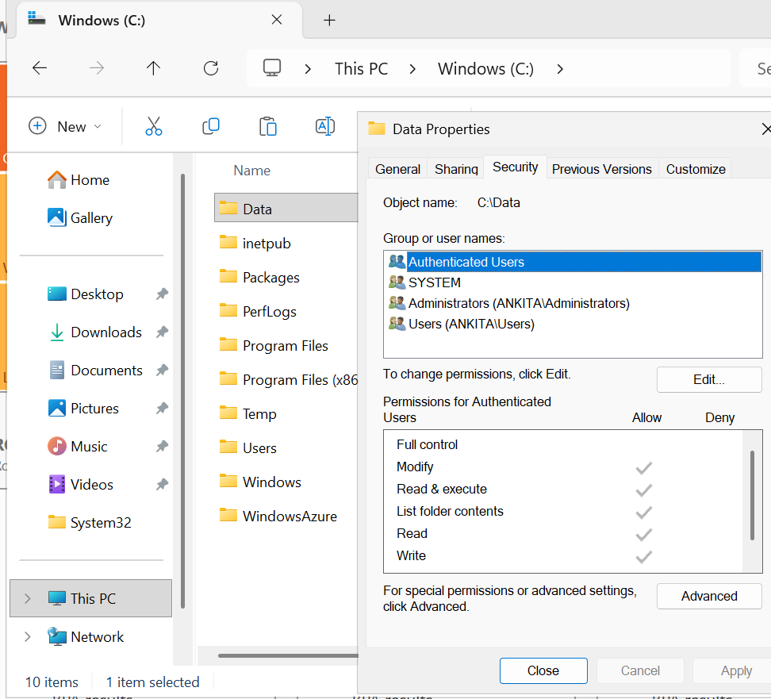

The intended access is **IT Team: Modify**, while keeping SYSTEM and Administrators with Full Control.

### Disable and convert inheritance

Inherited entries cannot be removed directly while inheritance is enabled.

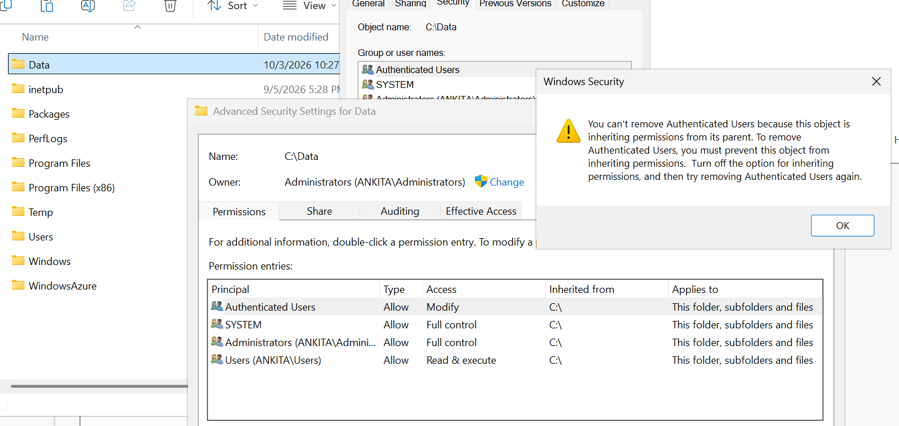

1. Open **Security > Advanced**.
2. Select **Disable inheritance**.
3. Choose **Convert inherited permissions into explicit permissions on this object**.

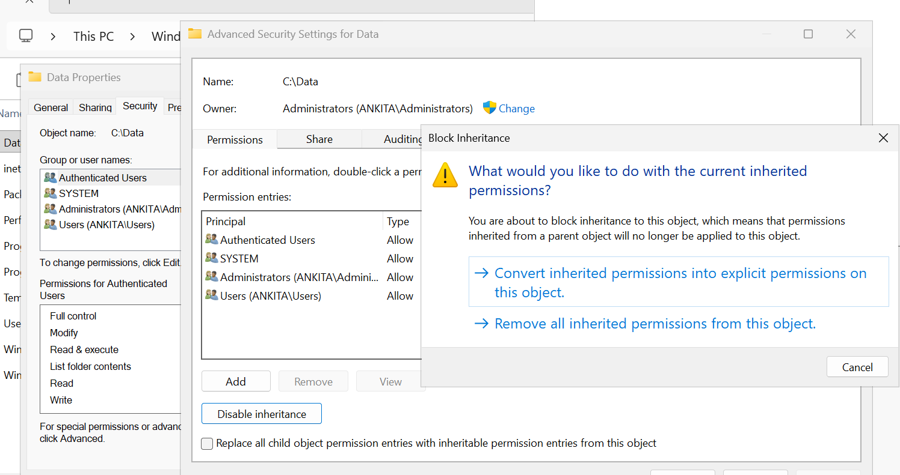

Conversion preserves the entries and makes them independently editable. The alternative, **Remove all inherited permissions**, removes those inherited entries; review remaining access before using it.

### Remove broad entries and add IT Team

1. Remove **Authenticated Users** and **Users** from Data's permissions.
2. Retain **SYSTEM** and **Administrators** with Full Control.
3. Add **ANKITA\IT Team**.
4. Select **Allow: Modify**, then apply the changes.

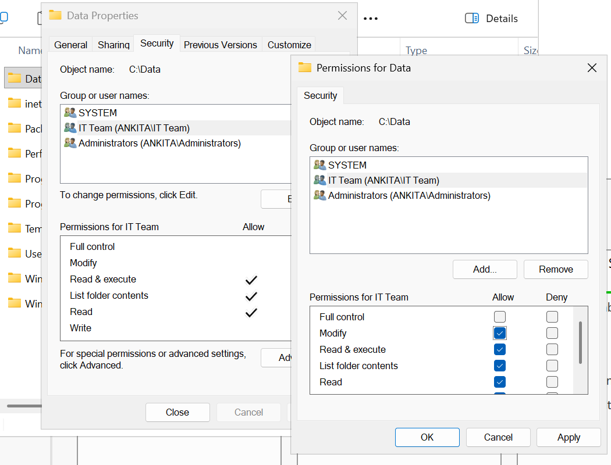

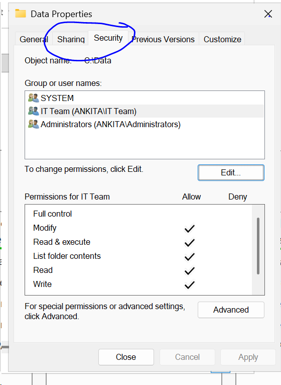

Use inheritance where it fits the folder structure. Separate folders with different access requirements can be easier to maintain than repeatedly breaking inheritance.

## Standard NTFS permissions

| Permission | Main capability |
| --- | --- |
| List folder contents | List folder names and browse folders; does not itself grant reading file contents |
| Read | Read file contents and attributes |
| Write | Create files/folders and write data; does not itself include Read or Delete |
| Read & execute | Read and execute files, and traverse folders |
| Modify | Read, write, execute, rename, and delete |
| Full Control | Modify plus changing permissions and taking ownership |

These are permission sets, not a strict ladder: **Write is independent of Read**. Renaming generally requires deletion rights as well as the relevant destination permissions. Script execution also depends on the interpreter and other controls; Read alone is not a reliable script-blocking method.

Modify usually provides the working access a team needs without granting permission-management rights. Full Control can allow changing access and ownership. Ownership can itself confer permission-management rights, so consider the owner when evaluating access.

## Share permissions versus NTFS permissions

NTFS applies to local and network file access. Share permissions apply when accessing the folder through that share over the network. Each requested operation must be allowed by both layers.

| Share permission | NTFS permission | Network result |
| --- | --- | --- |
| Full Control | Modify | Modify |
| Read | Modify | Read |

The three standard share permissions are **Read**, **Change**, and **Full Control**. Change broadly corresponds to working access such as creating, modifying, and deleting files. Share Full Control does not make a user a server administrator.

### Multiple groups and Deny

Allow permissions from multiple applicable groups accumulate within each layer. For example, IT Team granting Read and Managers granting Modify normally give a member of both groups Modify, provided no applicable Deny prevents the operation.

Deny should be used carefully. In a normally ordered ACL, explicit entries precede inherited entries, with Deny preceding Allow within the corresponding groups. “Deny always wins” is an oversimplification. Check all applicable entries and their inheritance.

## Sharing through Server Manager

Another route is **Server Manager > File and Storage Services > Shares > Tasks > New Share**.

1. Select **SMB Share - Quick**.
2. Choose the server and a custom folder path, such as `C:\test`.
3. Review the share name and other settings.
4. Review both share and folder permissions, using **Customize permissions** when needed.
5. Confirm the configuration and create the share.

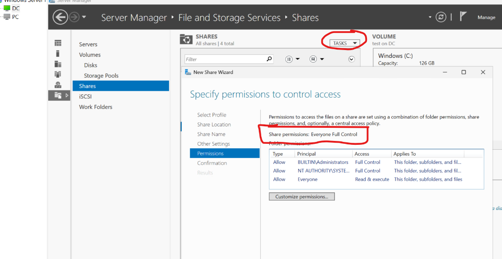

## Checking Effective Access in Windows GUI

1. Open **Folder Properties > Security > Advanced > Effective Access**.
2. Click **Select a user** and choose the account.
3. Click **View effective access** to calculate the displayed permissions.

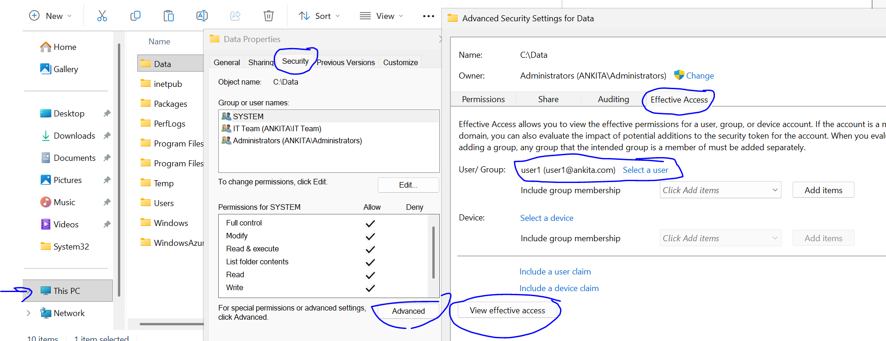

For network access, also check the share ACL. A local folder calculation alone does not establish access through every possible share. Verify access using the intended user's session and share path.

## Advanced NTFS permissions - Sales Managers example

I used a separate lab environment with the **RTSNETWORKING** domain for this Sales Managers example.

### Customize Delete rights

The goal is to let Sales-Managers delete items inside **Sales** while preserving the Sales folder itself.

1. Open **Advanced Security Settings**, select the Sales-Managers entry, and click **Edit**.
2. Select **Show advanced permissions**.
3. Clear **Delete** on the Sales folder's entry.
4. Keep **Delete subfolders and files** selected for the folder.
5. Review **Applies to**, the parent folder's permissions, and other group memberships.

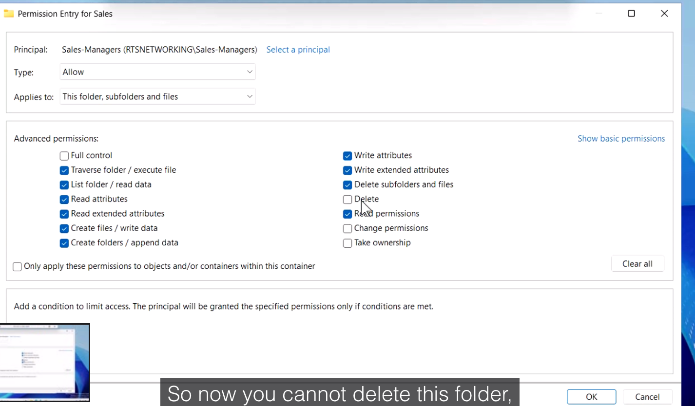

**Delete** allows deletion of the object. **Delete subfolders and files** allows deletion of children from their parent folder. Removing Delete from Sales alone does not guarantee protection: Delete child rights on its parent, or another applicable permission entry, may still allow deleting Sales. Evaluate the full effective access before concluding the folder is protected.

### Special permissions

Custom combinations that do not match a standard permission set appear as **Special**. Open Advanced to inspect the individual rights and scope.

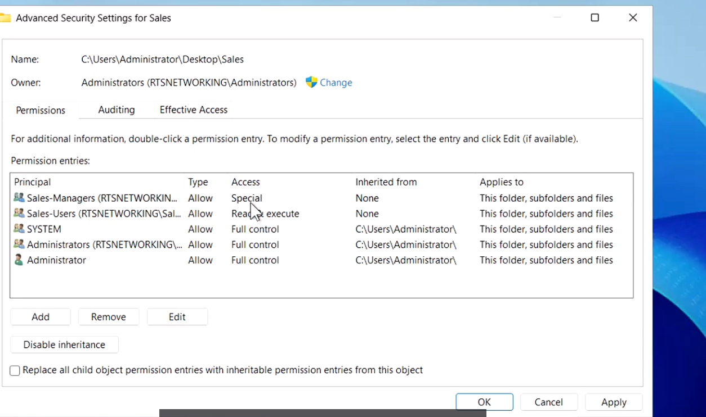

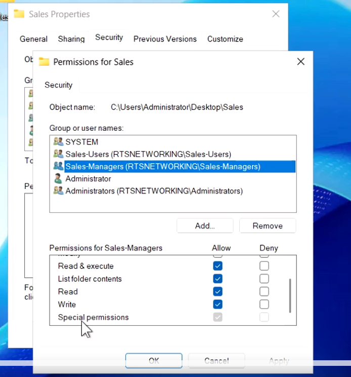

Restoring the standard Modify rights and scope returns the entry to Modify.

### Understanding Applies to

**Applies to** controls which objects receive an entry. Options include this folder only; this folder, subfolders and files; subfolders and files only; files only; and subfolders only.

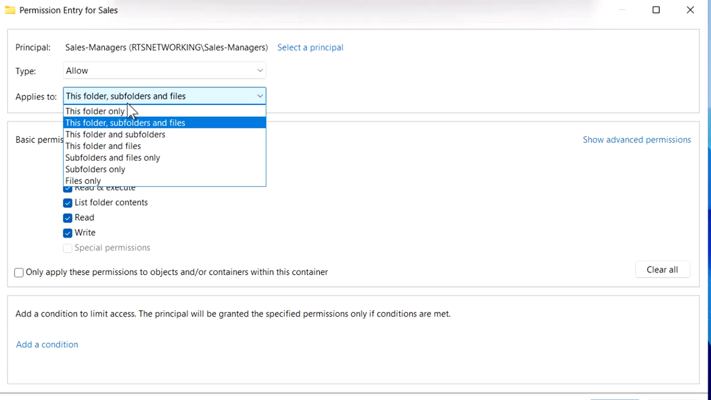

**Subfolders and files only** makes the entry apply to descendants, rather than the Sales folder itself. Review Advanced entries and the actual child objects to confirm the intended inheritance.

## Revision checklist

- SMB: TCP 445; UNC: `\\ServerName\ShareName`.
- Manage team access through security groups.
- Conversion keeps inherited entries as explicit permissions.
- Modify grants normal working access, including deletion.
- Network operations must pass both share and NTFS checks.
- Allow permissions accumulate; examine Deny and inheritance ordering.
- Check parent Delete child rights when protecting a folder.
- Advanced permissions expose individual rights and Applies to scope.

## References

- [Microsoft: File security and access rights](https://learn.microsoft.com/en-us/windows/win32/fileio/file-security-and-access-rights)
- [Microsoft: Order of ACEs in a DACL](https://learn.microsoft.com/en-us/windows/win32/secauthz/order-of-aces-in-a-dacl)
- [Microsoft: ReFS overview](https://learn.microsoft.com/en-us/windows-server/storage/refs/refs-overview)
