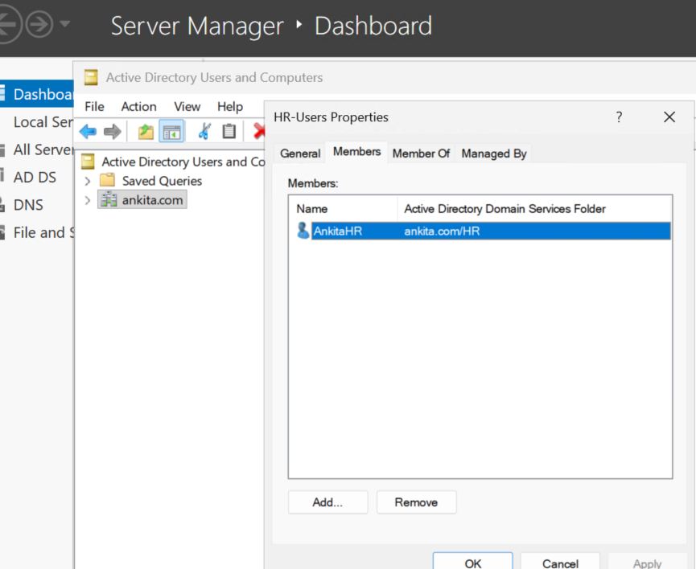
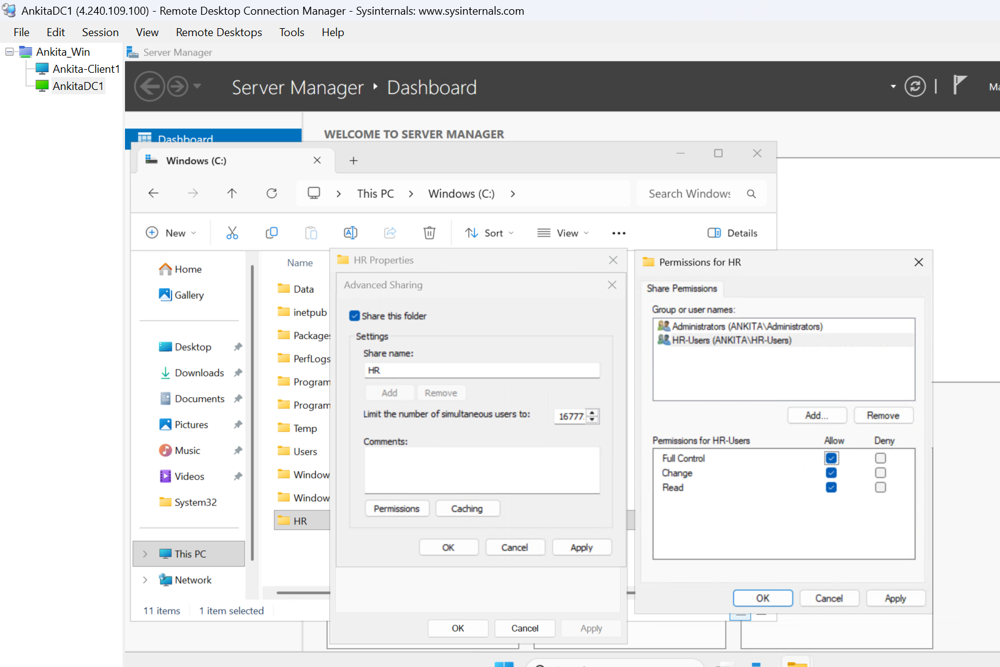
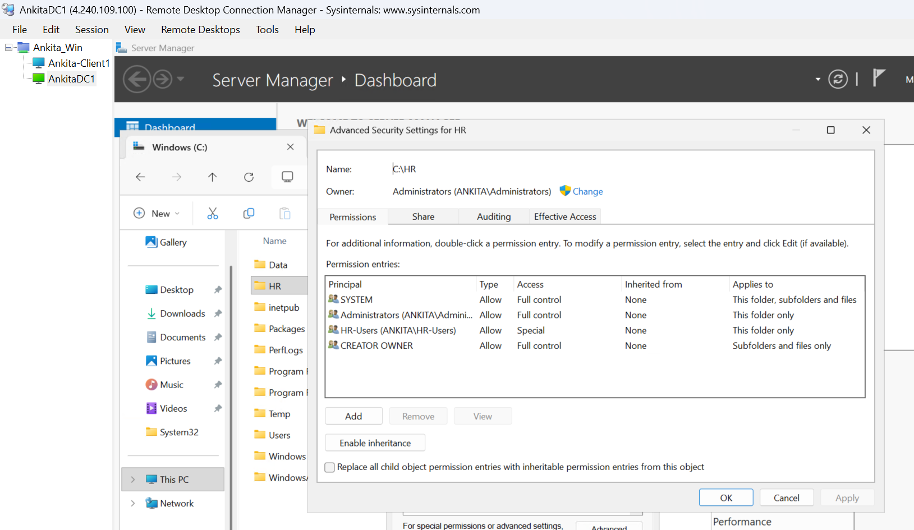
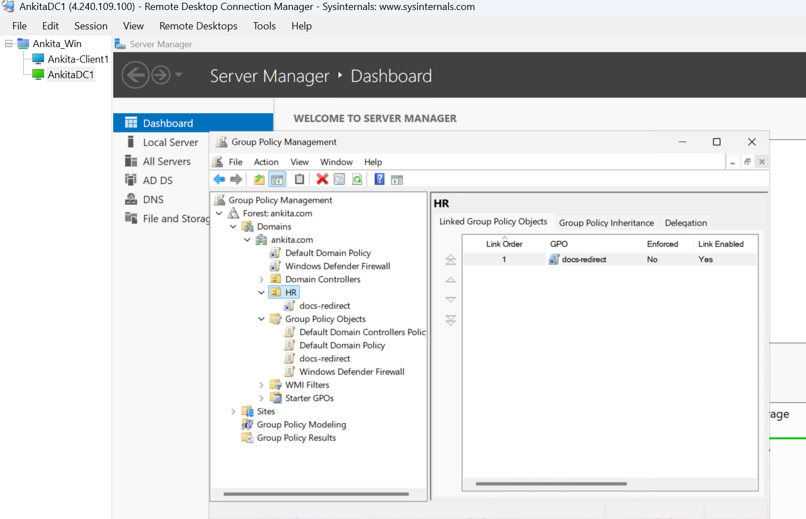
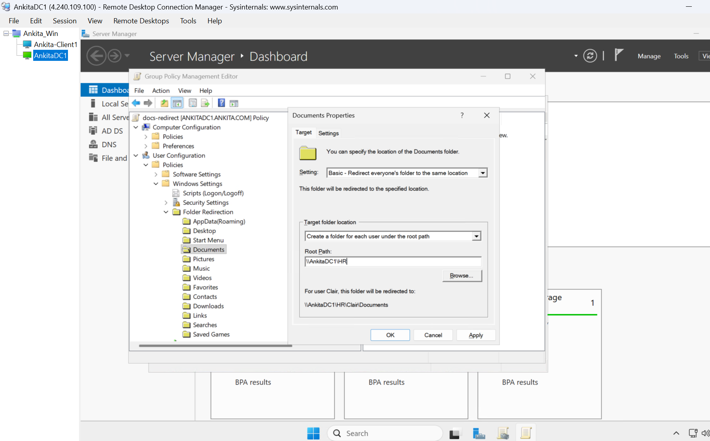
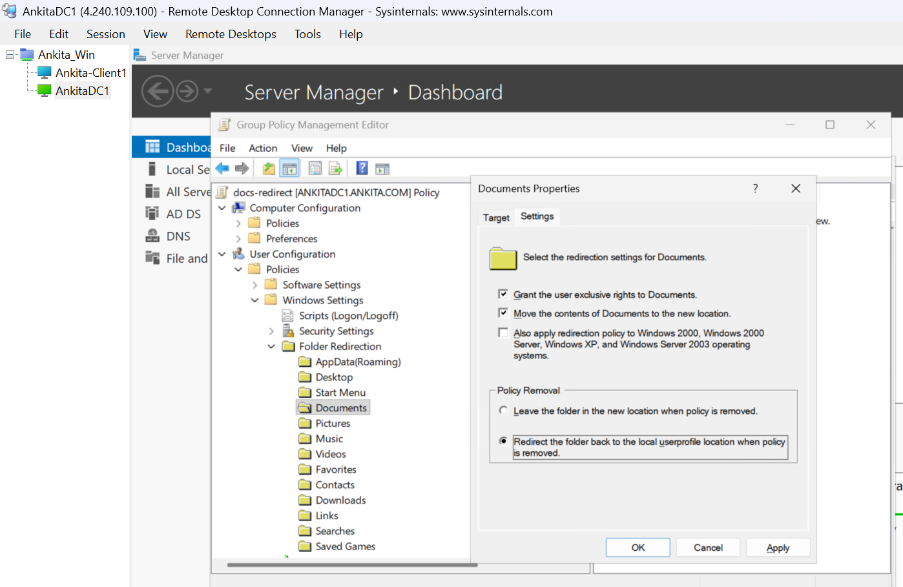
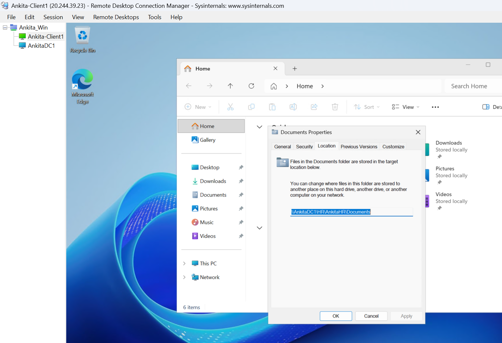
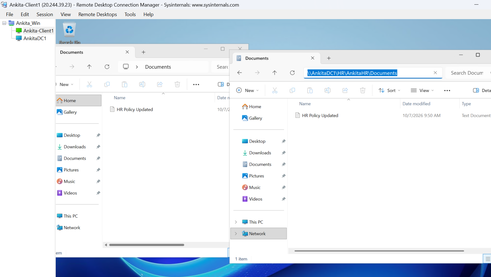

# Folder Redirection Using Group Policy

**Ankita Srivastava | Windows Server Lab**

## Objective

Use Group Policy to redirect an HR user's **Documents** folder to a shared folder on **AnkitaDC1**, then verify the location and file access from **Ankita-Client1**.

Folder Redirection centralizes user files and makes server-side backup easier. It does not create a backup by itself.

## Lab Environment

| Component | Configuration |
| --- | --- |
| Domain controller and lab file server | AnkitaDC1 |
| Domain-joined test computer | Ankita-Client1, running Windows Server 2025 |
| Domain | ankita.com |
| Organizational unit | HR |
| Test user | AnkitaHR |
| Security group | HR-Users |
| Shared folder | C:\HR |
| Network share | `\\AnkitaDC1\HR` |
| GPO | docs-redirect |
| Redirected folder | Documents |

## Before Starting

- Confirm that Ankita-Client1 is joined to **ankita.com** and can contact the DC using its configured DNS server.
- Use an administrator account to create the share, user, group, and GPO. Test redirection as the regular domain user **AnkitaHR**.
- If testing through Remote Desktop, ensure the test account has permission to sign in to Ankita-Client1 through Remote Desktop. Do not make it an administrator just for this test.
- This lab uses the DC and its C: drive for storage. A separate file server and data volume are preferable in a production environment.

## Step 1: Create the HR OU, Test User, and Group

On **AnkitaDC1**:

1. Open **Server Manager → Tools → Active Directory Users and Computers**.
2. Right-click **ankita.com → New → Organizational Unit**.
3. Name the OU **HR**.
4. Inside HR, create a user with the logon name **AnkitaHR** and set a lab password.
5. At the domain root, create a **Global, Security** group named **HR-Users**.
6. Add **AnkitaHR** to **HR-Users**.

The OU determines where the user policy is linked. The security group is used to grant access to the file share.



## Step 2: Create and Share the HR Folder

On **AnkitaDC1**:

1. Open File Explorer and create **C:\HR**.
2. Right-click **HR → Properties → Sharing → Advanced Sharing**.
3. Select **Share this folder** and use the share name **HR**.
4. Select **Permissions**.
5. Remove the default **Everyone** entry, add **HR-Users**, and allow **Full Control**.
6. Add **Administrators** with **Full Control** for share administration.
7. Apply the changes.

Share permissions allow network access. NTFS permissions, configured next, control what users can do within the folder. Both permission sets apply when accessing files over the network.



## Step 3: Configure NTFS Permissions

On the **new C:\HR folder only**:

1. Open **Properties → Security → Advanced**.
2. Select **Disable inheritance → Convert inherited permissions into explicit permissions on this object**.
3. Configure the entries below. Remove other broad user entries from this lab folder, while retaining SYSTEM and Administrators as shown.
4. Use **Show advanced permissions** when setting the HR-Users entry.
5. Add **CREATOR OWNER** if it is not already listed. Apply the permissions below and click **OK**.

| Account or group | Permission | Applies to |
| --- | --- | --- |
| SYSTEM | Full Control | This folder, subfolders and files |
| Administrators | Full Control | This folder only |
| CREATOR OWNER | Full Control | Subfolders and files only |
| HR-Users | Advanced permissions listed below | This folder only |

For **HR-Users**, allow:

- Traverse folder / execute file
- List folder / read data
- Read attributes
- Read extended attributes
- Create folders / append data
- Read permissions

This lets HR users create their own folders under the share without granting them Full Control over everyone's data. **Grant the user exclusive rights**, configured later, protects the redirected folder; it does not replace correct permissions on the share root.



## Step 4: Verify the Share

In File Explorer, browse to:

```text
\\AnkitaDC1\HR
```

Confirm that the share opens. The path starts with **two backslashes**. Only **HR** is created manually. Folder Redirection creates **AnkitaHR\Documents** automatically when the policy successfully applies at sign-in.

## Step 5: Create and Link the GPO

On **AnkitaDC1**:

1. Open **Server Manager → Tools → Group Policy Management**.
2. Expand **Forest: ankita.com → Domains → ankita.com**.
3. Refresh the view if the new HR OU is not visible.
4. Right-click the **HR OU**.
5. Select **Create a GPO in this domain, and Link it here**.
6. Name the GPO **docs-redirect**.
7. Leave the default **Authenticated Users** security filtering in place for this lab.
8. Right-click **docs-redirect → Edit**.

This is a **user policy**. The test user's account must be in the HR OU; the client computer account does not need to be moved into that OU.



## Step 6: Configure Documents Redirection

Navigate to:

**User Configuration → Policies → Windows Settings → Folder Redirection**

1. Right-click **Documents → Properties**.
2. On the **Target** tab, configure:

| Setting | Value |
| --- | --- |
| Setting | Basic – Redirect everyone's folder to the same location |
| Target folder location | Create a folder for each user under the root path |
| Root Path | `\\AnkitaDC1\HR` |

For AnkitaHR, the resulting path should be:

```text
\\AnkitaDC1\HR\AnkitaHR\Documents
```

Each user receives a separate folder beneath the same share. Users do not all share one Documents folder.



### Basic vs. Advanced

- **Basic:** Uses the same target configuration for all users within the GPO's scope. In this lab, each user gets a folder beneath HR.
- **Advanced:** Selects different target locations based on security-group membership, for example separate shares for HR staff and managers. Users still need to be within the GPO's scope.

This lab uses **Basic**.

## Step 7: Review the Settings Tab

Configure the following:

| Setting | Lab selection | Purpose |
| --- | --- | --- |
| Grant the user exclusive rights to Documents | Selected | Restricts normal access to the user's redirected Documents folder |
| Move the contents of Documents to the new location | Selected | Transfers existing Documents files to the share |
| Policy Removal | Redirect the folder back to the local userprofile location when policy is removed | Returns the folder locally when the policy stops applying |

Click **Apply**, then **OK**. If a compatibility warning for older Windows versions appears, review it and confirm to save the configuration.

With the selected removal behavior, contents are copied back to the local profile and the server copy remains. The alternative, **Leave the folder in the new location**, keeps the folder on the share; removing the policy alone does not remove the user's access.

If changing removal behavior later, allow the updated policy to apply before removing its link.



## Step 8: Sign In as the Test User

For this Remote Desktop lab, first open an administrator Command Prompt on **Ankita-Client1** and grant the test user Remote Desktop access:

```cmd
net localgroup "Remote Desktop Users" "ANKITA\AnkitaHR" /add
```

Connect to **Ankita-Client1** using the test user's password and this username:

```text
AnkitaHR@ankita.com
```

If the user was already signed in before the policy was configured, run:

```cmd
gpupdate /force
```

Then **sign out** and sign back in so Folder Redirection can process during sign-in. Closing the Remote Desktop window only disconnects the session. Allow time for any existing files to transfer.

A policy-processing message may appear, but the next steps provide the actual verification.

## Step 9: Verify the Documents Location

While signed in as **AnkitaHR** on **Ankita-Client1**:

1. Open File Explorer.
2. Right-click the user's **Documents** folder and select **Properties**.
3. Open the **Location** tab.
4. Confirm the location is:

```text
\\AnkitaDC1\HR\AnkitaHR\Documents
```



## Step 10: Create and Verify a Test File

Still signed in as **AnkitaHR**:

1. Open Documents and create a text file named **HR Policy.txt**.
2. Open a second File Explorer window and browse to:

```text
\\AnkitaDC1\HR\AnkitaHR\Documents
```

3. Confirm that the same file is visible.
4. Rename the file in Documents to **HR Policy Updated.txt**.
5. Refresh the network-path window and confirm the new name appears.

The two windows show the same redirected folder. This test verifies the network location, not a separate offline-synchronization setup.

Use the test user's session for this check. With exclusive rights enabled, an administrator may receive Access Denied when trying to browse the user's Documents folder; do not take ownership merely to capture a screenshot.



## Result

- The Documents folder for AnkitaHR points to the HR share on AnkitaDC1.
- A file created through Documents is accessible at the matching network path.
- The GPO applies through the HR OU to the test user.

## Key Takeaways

- Folder Redirection is configured under **User Configuration**.
- Creating a GPO is not enough; it must be linked and the user must be in scope.
- Share and NTFS permissions both matter.
- Centralized files still require a configured backup plan.
- Users can access the same redirected files on other domain-joined computers where the policy applies and the share is reachable.
- Offline availability is separate. Offline Files is disabled by default on Windows Server, including the server used as the client in this lab; offline access is not part of this test.

## Skills Practiced

- Active Directory users, groups, and OUs
- GPO creation and linking
- Folder Redirection
- SMB shares and NTFS permissions
- Policy application and file-access verification

## References

- [Microsoft: Deploy Folder Redirection](https://learn.microsoft.com/en-us/windows-server/storage/folder-redirection/deploy-folder-redirection)
- [Microsoft: Configure Folder Redirection with Group Policy](https://learn.microsoft.com/en-us/windows-server/storage/folder-redirection/folder-redirection-using-group-policy)

---

Ankita Srivastava | [SAnkitaTech](https://github.com/SAnkitaTech)
