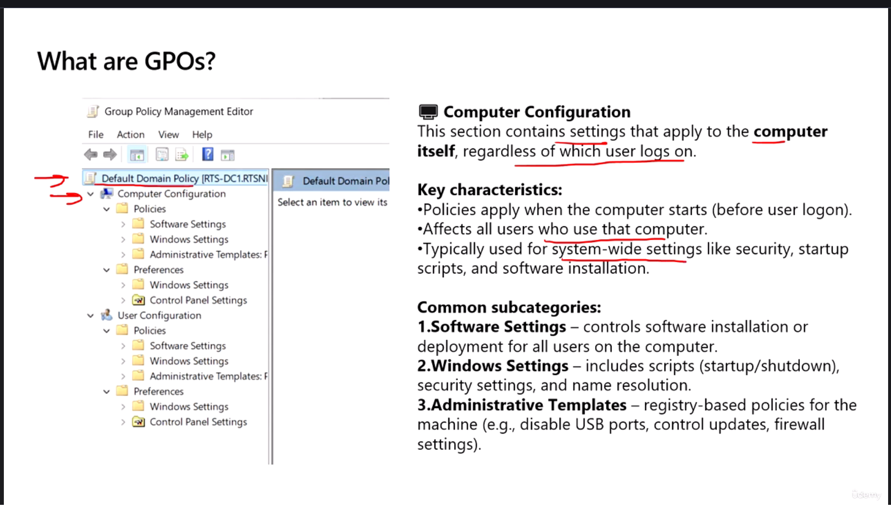
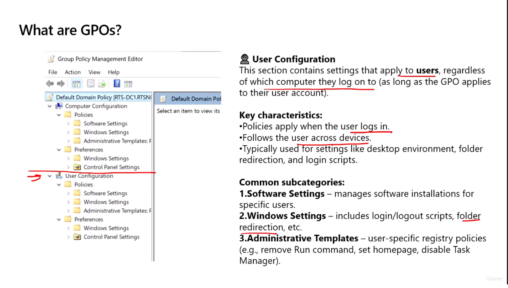
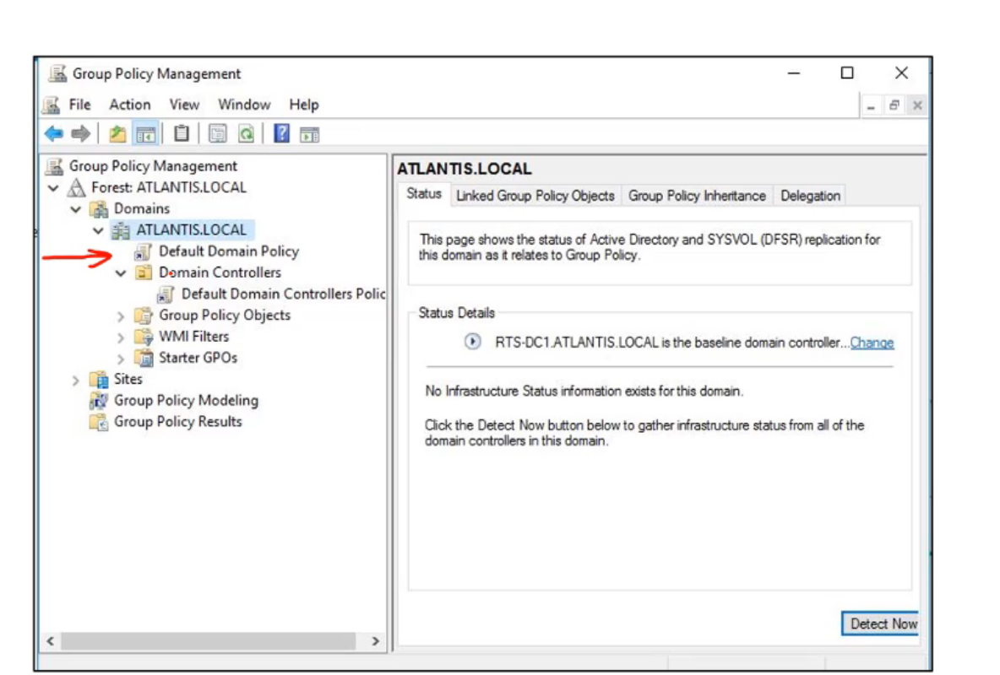

# Group Policy Fundamentals and Troubleshooting

**Ankita Srivastava | Windows Server Study Notes**

## 1. What Is a Group Policy Object?

A **Group Policy Object (GPO)** is a collection of settings used to manage Windows computers and users centrally through Active Directory.

Common uses include password policies, desktop restrictions, firewall settings, folder redirection, and software deployment.

Before creating a policy, decide:
- **Who needs it?** Identify the users or computers.
- **Where should it apply?** Link the GPO to the appropriate site, domain, or organizational unit (OU).

Creating a GPO under **Group Policy Objects** does not link it automatically. It needs a link to apply through Active Directory, and security or WMI filtering can further limit its scope.

## 2. Computer and User Configuration

| Configuration | Applies to | Normal processing | Examples |
| --- | --- | --- | --- |
| Computer Configuration | Computer accounts | Startup and background refresh | Firewall settings, computer restrictions |
| User Configuration | User accounts | Sign-in and background refresh | Desktop restrictions, folder redirection |

Some settings require startup or sign-in processing. Computer settings normally follow the computer; user settings normally follow the user, subject to policy scope and filtering.

Both sections contain **Policies** and **Preferences**. Under Policies, the main folders include Software Settings, Windows Settings, and Administrative Templates.

### Computer Configuration



For example, disk quota settings are under:

**Computer Configuration → Policies → Administrative Templates → System → Disk Quotas**

### User Configuration



For example:
- Folder redirection: **User Configuration → Policies → Windows Settings → Folder Redirection**
- Mapped drives: **User Configuration → Preferences → Windows Settings → Drive Maps**

Folder redirection can place folders such as Documents on a central file share. It does not create a backup by itself.

### Software Deployment

Group Policy Software Installation can assign supported MSI packages to computers or users, or publish them to users. Windows Installer applications can support repair. Dedicated software-management tools offer broader deployment and reporting features.

## 3. Default Group Policy Objects

| Default GPO | Default link | Purpose |
| --- | --- | --- |
| Default Domain Policy | Domain | Contains domain account-policy settings, including password and account-lockout policies |
| Default Domain Controllers Policy | Domain Controllers OU | Contains settings intended for domain controllers |

A newly promoted domain controller normally has its computer account in the **Domain Controllers OU**.



For individual labs, create a clearly named GPO instead of adding unrelated settings to a default policy.

## 4. Group Policy Processing Order — LSDOU

The normal processing order is:

**Local → Site → Domain → OU**

| Level | Scope |
| --- | --- |
| Local | Policy configured on the individual computer, for example through gpedit.msc |
| Site | GPOs linked to the computer's Active Directory site |
| Domain | GPOs linked to the domain |
| OU | GPOs linked to the relevant OU hierarchy, from parent OU to child OU |

When applicable policies configure the **same setting** differently, the later setting normally wins. Settings that do not conflict can combine.

**Example:** If a domain-linked GPO enables a desktop restriction and a child OU-linked GPO disables that same restriction, the OU setting normally wins.

Exceptions and related controls:
- **Enforced:** Protects settings in a GPO link from being overridden by lower-level GPOs.
- **Block Inheritance:** Blocks inherited GPOs, but not enforced links.
- **Link Order:** At the same site, domain, or OU, link order **1** has the highest precedence.
- **Filtering:** Security and WMI filters determine whether a GPO applies.

Domain-account password policies are configured at the domain level. Linking a password-policy GPO to an OU does not give those domain users a different domain password policy.

See [Active Directory OUs and Applying Group Policy](../../03-active-directory-ou-and-group-policy/README.md) for linking and filtering examples.

## 5. Refreshing Group Policy

Open Command Prompt on the target computer.

| Command | Purpose |
| --- | --- |
| `gpupdate` | Refresh policy, normally processing changed settings |
| `gpupdate /force` | Reapply all applicable policy settings |

Group Policy uses version information to detect changes. The `/force` option does not apply every GPO in the domain; scope and filtering still apply.

Some changes require signing out or restarting. Follow any prompt from GPUpdate. A successful refresh alone does not prove that the intended GPO applied.

## 6. Checking Results with GPResult

GPResult shows the policies that applied to a user or computer.

### Summary

```cmd
gpresult /r
```

### Computer Policy

Run in an administrator Command Prompt:

```cmd
gpresult /scope computer /r
```

Look under **Applied Group Policy Objects** for the intended GPO.

### User Policy

Run in the affected user's session:

```cmd
gpresult /scope user /r
```

Using a different administrator account can show that account's user results instead.

### HTML Report

From a folder where you can save files:

```cmd
gpresult /h GPSettings.html
```

Open **GPSettings.html** in a browser. To overwrite an existing report:

```cmd
gpresult /h GPSettings.html /f
```

Use the report to inspect applied GPOs, filtering information, configured settings, and the winning GPO where shown.

## 7. Simple Troubleshooting Checklist

1. Confirm that the setting belongs under Computer Configuration or User Configuration.
2. Check that the GPO is linked to the correct site, domain, or OU and the link is enabled.
3. Confirm the target account is in scope and has permission to read and apply the GPO. Check any WMI filter.
4. Check that the relevant GPO configuration section is enabled.
5. Run `gpupdate /force`, then sign out or restart if required.
6. Use GPResult to check whether the GPO applied and whether another GPO won a conflicting setting.
7. If policy still cannot be retrieved, check DNS and domain-controller connectivity. In environments with multiple domain controllers, also check replication.

**Lab reminder:** A computer in the default Computers container can receive domain-linked GPOs. Move it into an OU when you need to target that OU with a GPO.

## References

- [Microsoft: Group Policy processing](https://learn.microsoft.com/en-us/windows-server/identity/ad-ds/manage/group-policy/group-policy-processing)
- [Microsoft: GPUpdate](https://learn.microsoft.com/en-us/windows-server/administration/windows-commands/gpupdate)
- [Microsoft: GPResult](https://learn.microsoft.com/en-us/windows-server/administration/windows-commands/gpresult)

---

© 2026 Ankita Srivastava. Third-party instructional illustrations remain the property of their respective owners.
