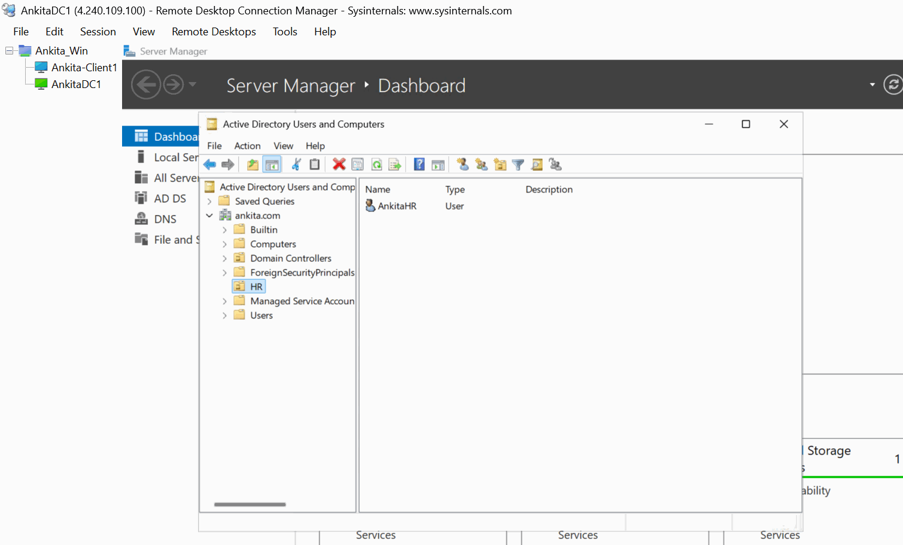
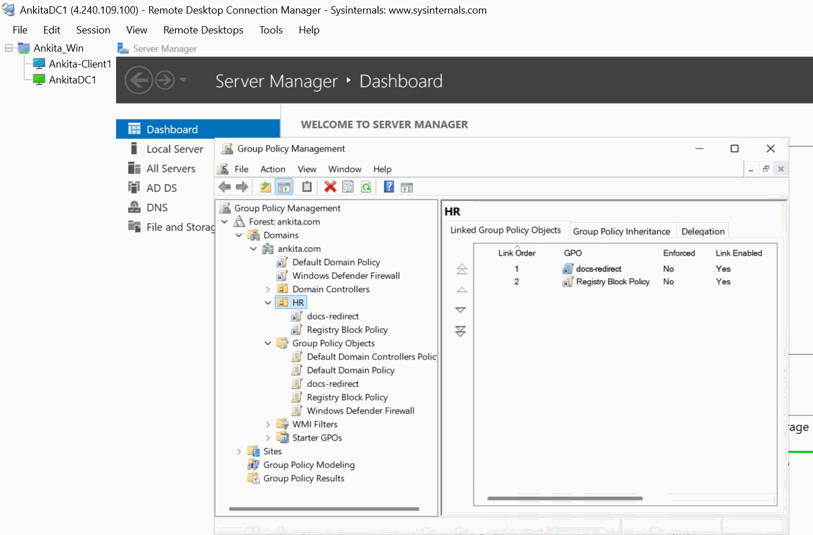
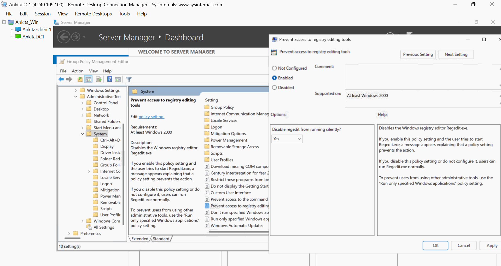
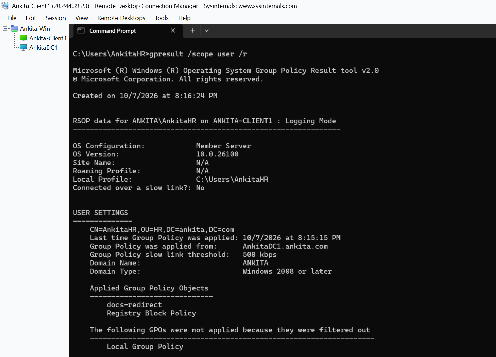
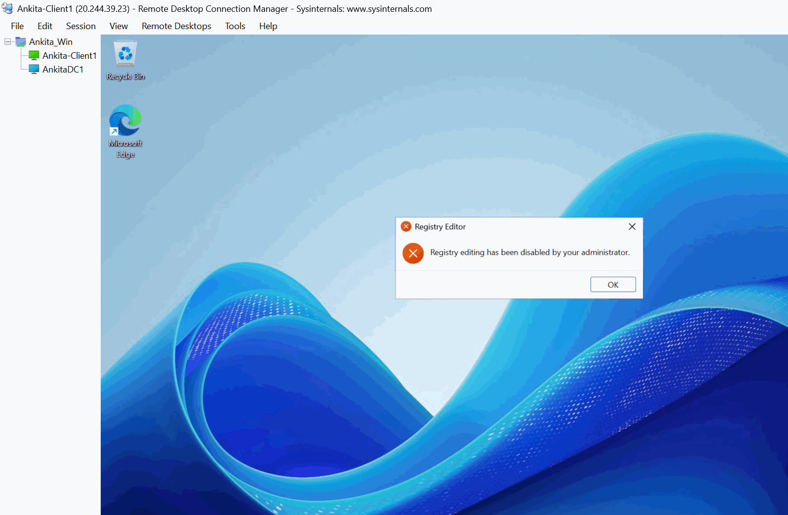

# Block Registry Editor Using Group Policy

**Ankita Srivastava | Windows Server Lab**

## Objective

Apply a user Group Policy Object to the HR OU and verify that the `AnkitaHR` account cannot open Registry Editor on the domain-joined client.

## Lab Environment

| Component | Configuration |
| --- | --- |
| Domain controller | AnkitaDC1 |
| Client computer | Ankita-Client1 |
| Domain | ankita.com |
| Organizational unit | HR |
| Test user | AnkitaHR |
| GPO | Registry Block Policy |

## Step 1: Confirm the Test User Is in the HR OU

On **AnkitaDC1**, open **Active Directory Users and Computers** and confirm that the **AnkitaHR** user account is in the **HR** OU. The GPO in this lab is a user policy, so the user account must be in the OU where the policy is linked.



## Step 2: Create and Link the GPO

In **Group Policy Management** on **AnkitaDC1**:

1. Right-click the **HR** OU.
2. Select **Create a GPO in this domain, and Link it here**.
3. Name it **Registry Block Policy**.
4. Leave the default **Authenticated Users** security filtering in place for this lab.
5. Confirm that the GPO appears under the HR OU with its link enabled.



## Step 3: Enable the Registry Editor Policy

Edit **Registry Block Policy** and navigate to:

**User Configuration → Policies → Administrative Templates → System**

In the right pane, open **Prevent access to registry editing tools**. Select **Enabled**, set **Disable regedit from running silently?** to **Yes**, and select **Apply → OK**.



## Step 4: Update and Verify the User Policy

On **Ankita-Client1**, sign in as **AnkitaHR**. In that user's Command Prompt, run:

```cmd
gpupdate /force
gpresult /scope user /r
```

Under **Applied Group Policy Objects**, confirm that **Registry Block Policy** appears. Make sure `gpresult` is being run in the AnkitaHR session so it reports that user's policies.



## Step 5: Test Registry Editor

Close any open Registry Editor window. From the **AnkitaHR** session, open Start and search for **Registry Editor**. The policy should block it and display a message that registry editing has been disabled by the administrator.



## Result

The **Registry Block Policy** is linked to the **HR** OU, appears in the test user's applied policy results, and prevents **AnkitaHR** from opening Registry Editor on **Ankita-Client1**.

This setting controls access to Registry Editor (`regedit.exe`). It should not be described as preventing every possible way of changing registry values.

## Troubleshooting Notes

- Confirm **AnkitaHR** is in the **HR** OU and the GPO link is enabled.
- Confirm the setting is under **User Configuration** and is set to **Enabled**.
- Run `gpresult /scope user /r` from the **AnkitaHR** session and check **Applied Group Policy Objects**.
- If the policy is not listed, check domain connectivity and refresh policy with `gpupdate /force`.

## Skills Practiced

- Active Directory user and OU verification
- GPO creation and linking
- User Configuration policy settings
- Group Policy refresh and verification
