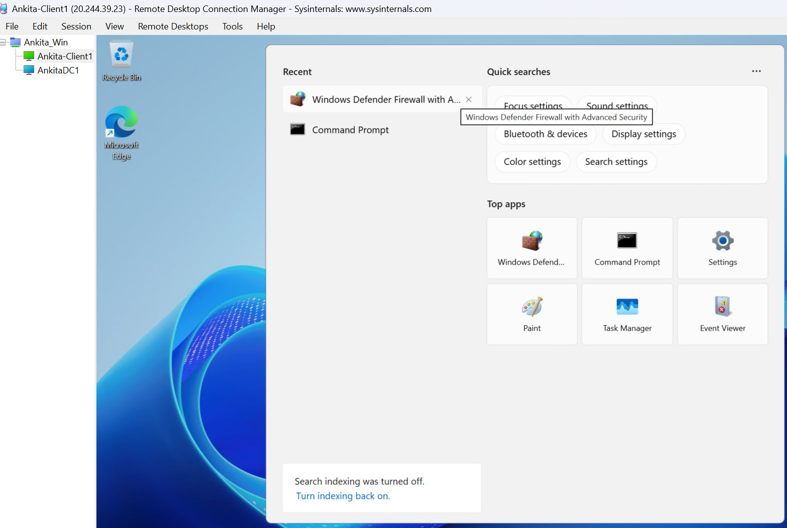
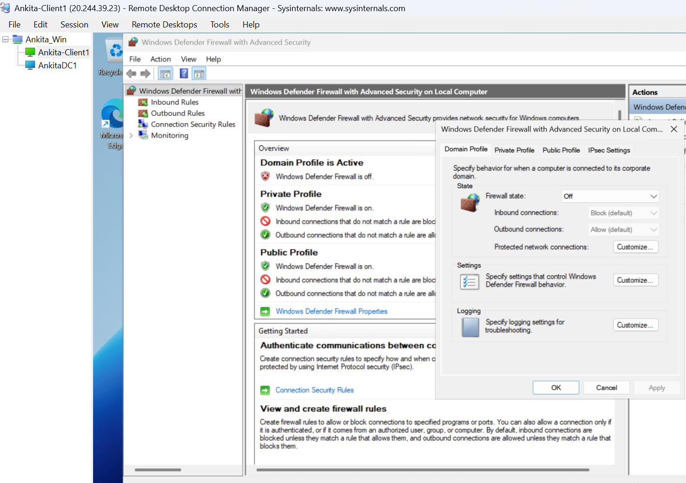
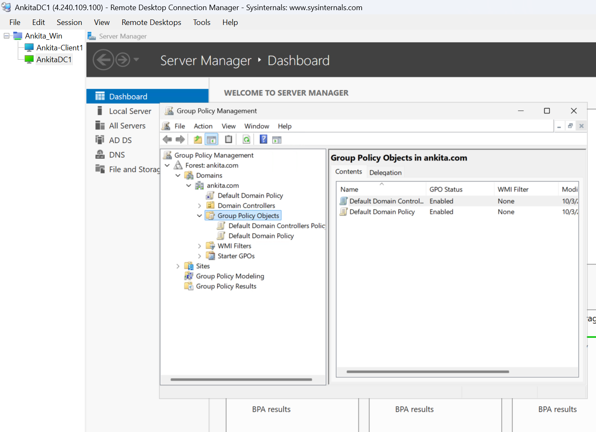
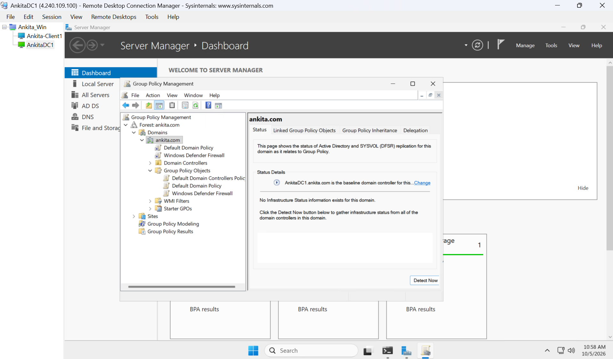
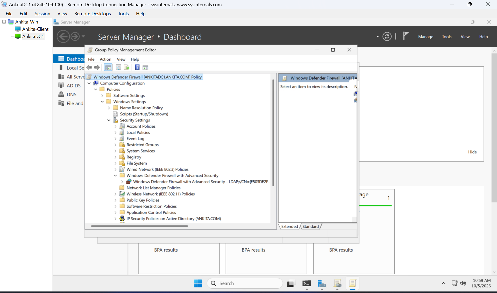
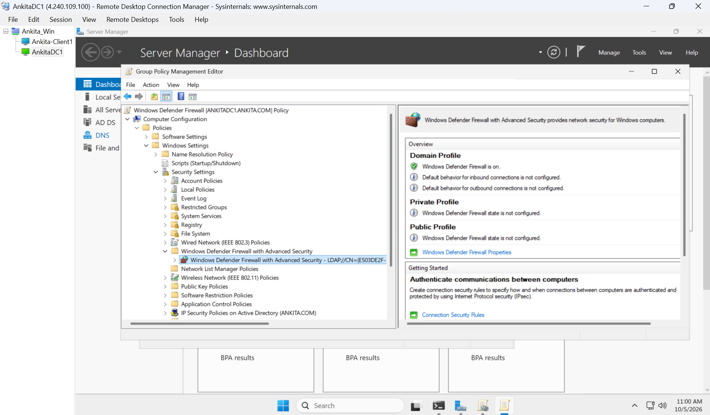
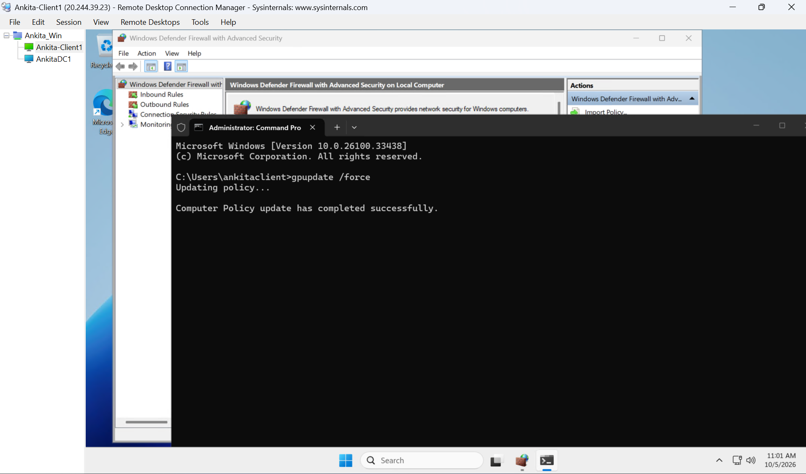
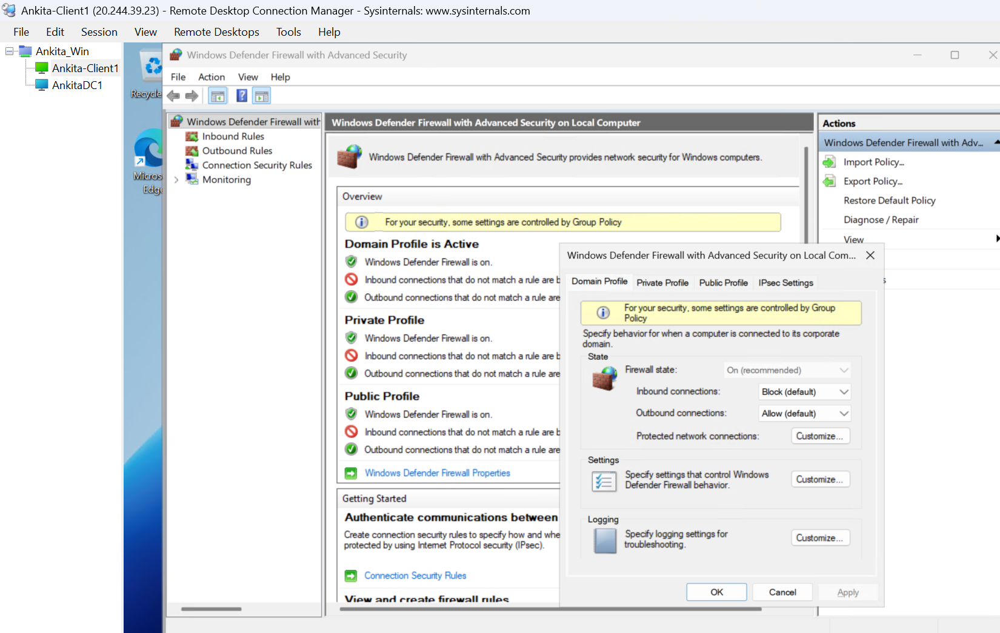

# Windows Defender Firewall Management Using Group Policy

**Ankita Srivastava | SAnkitaTech**

## Objective

Use Group Policy to enable the Windows Defender Firewall **Domain profile** and prevent changes to that setting through the local firewall interface.

## Lab environment

| Component | Configuration |
| --- | --- |
| Domain controller | AnkitaDC1 |
| Member server | Ankita-Client1 |
| Active Directory domain | ankita.com |
| Operating system | Windows Server 2025 |
| GPO | Windows Defender Firewall |

## Step 1: Verify Firewall Status on the Member Server

On **Ankita-Client1**:

1. Open **Windows Defender Firewall with Advanced Security**.
2. Right-click **Windows Defender Firewall with Advanced Security on Local Computer** and select **Properties**.
3. Under **Domain Profile**, verify the firewall state.
4. For this lab demonstration, set **Firewall state** to **Off** and apply the change.





## Step 2: Open Group Policy Management

On **AnkitaDC1**, open **Server Manager → Tools → Group Policy Management**.



## Step 3: Create and Link the GPO

1. Right-click **ankita.com**.
2. Select **Create a GPO in this domain, and Link it here**.
3. Name it **Windows Defender Firewall**.
4. Click **OK**.

The GPO appears directly beneath **ankita.com** as a link and in the **Group Policy Objects** folder.



## Step 4: Edit the GPO

Right-click **Windows Defender Firewall** and select **Edit**.

Navigate to:

**Computer Configuration → Policies → Windows Settings → Security Settings → Windows Defender Firewall with Advanced Security**

Select the **Windows Defender Firewall with Advanced Security** node inside that folder.



## Step 5: Configure the Domain Profile

1. Open **Windows Defender Firewall Properties**.
2. Select the **Domain Profile** tab.
3. Set **Firewall state → On (recommended)**.
4. Click **Apply**, then **OK**.

The policy overview shows the Domain profile firewall is **On**. Private and Public profiles remain **Not configured** in this GPO. Profiles apply according to the detected network type.



## Step 6: Update Group Policy on the Member Server

On **Ankita-Client1**, open **Command Prompt as Administrator** and run:

```cmd
gpupdate /force
```

Confirm that the computer policy update completes successfully.



## Step 7: Verify Policy Application

Refresh **Windows Defender Firewall with Advanced Security** on **Ankita-Client1**.

Confirm that:

- The **Domain Profile is Active** and its firewall is **On**.
- Windows displays: **For your security, some settings are controlled by Group Policy.**
- In **Properties → Domain Profile**, the **Firewall state** setting is grayed out.



## Result

The GPO enabled the Windows Defender Firewall Domain profile on **Ankita-Client1**. The firewall state is grayed out in the local interface, preventing changes there even when using local administrator rights.

## Skills Demonstrated

- Group Policy Management Console (GPMC)
- GPO creation and linking
- Computer Configuration policies
- Windows Defender Firewall administration
- Group Policy processing with gpupdate
- Policy verification

## Portfolio Summary

Configured and linked a GPO to **ankita.com** to enable the Windows Defender Firewall Domain profile. Applied the policy on **Ankita-Client1** and verified that the firewall was enabled and its state could no longer be changed through the local firewall interface.

---

Copyright © 2026 Ankita Srivastava. Original lab notes and screenshots. Please request permission before reusing.
