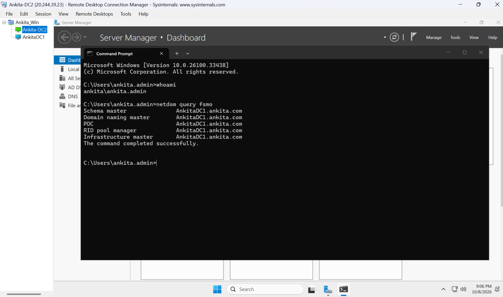
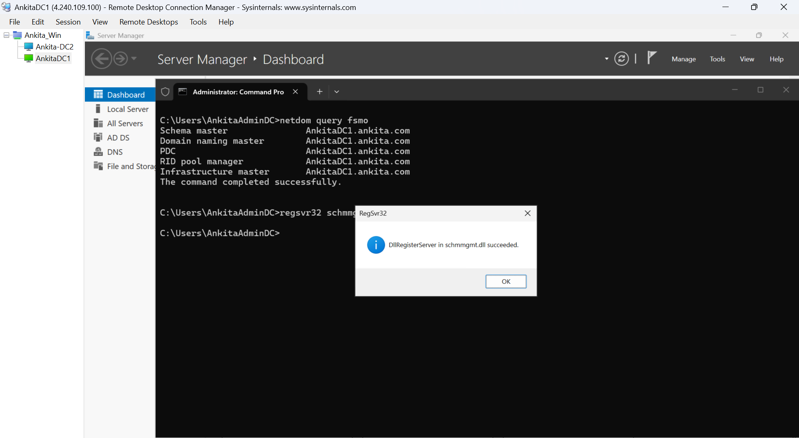
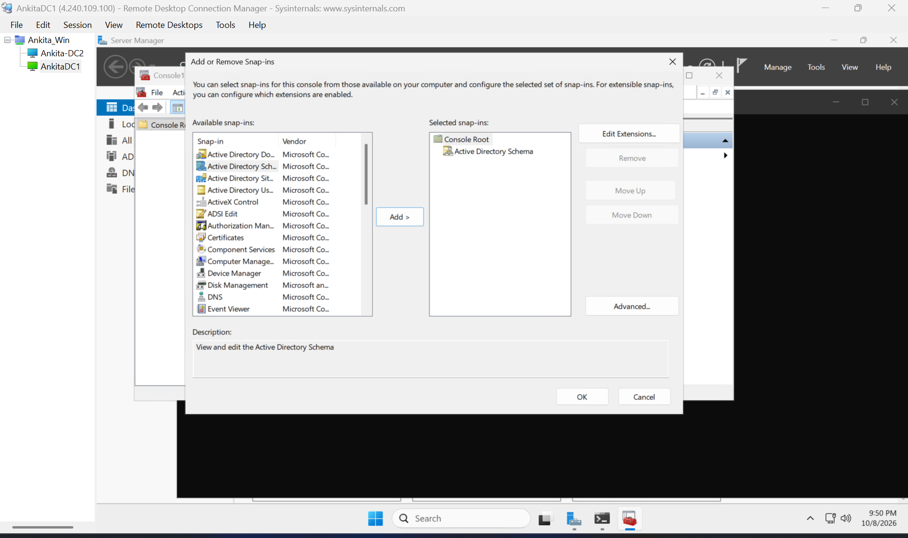
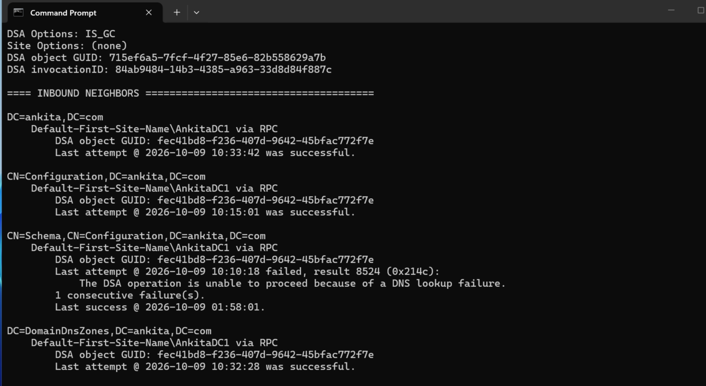
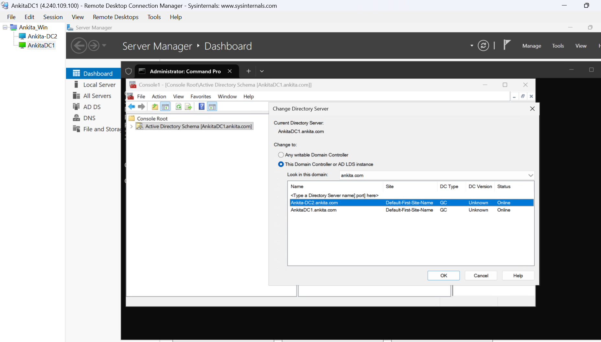
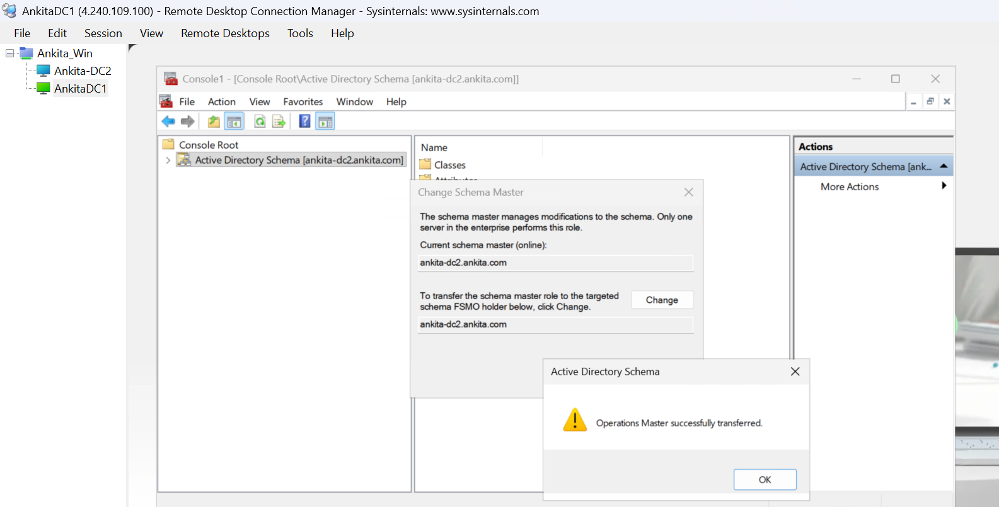
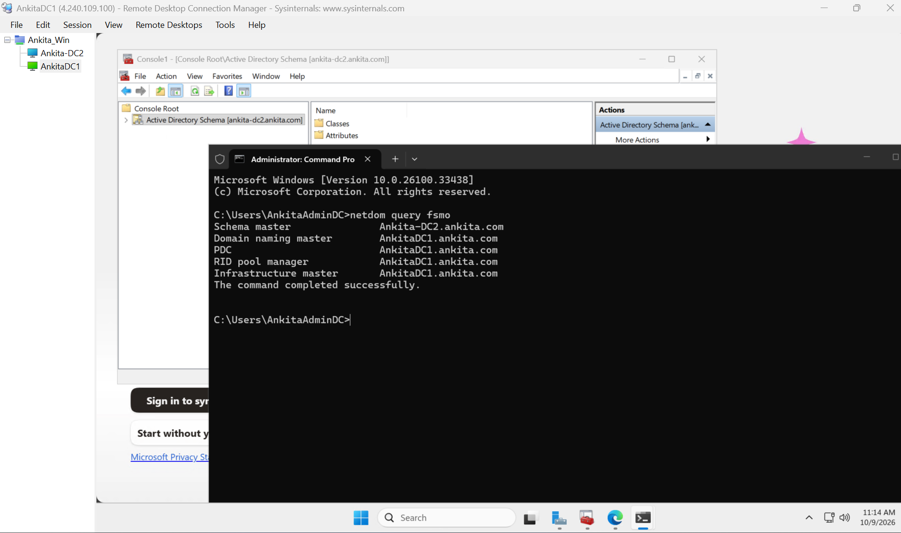

# FSMO Roles: Schema Master Transfer

## Lab overview

This lab reviews the two forest-wide Flexible Single Master Operations (FSMO) roles and documents my transfer of the **Schema Master** role from **AnkitaDC1** to **Ankita-DC2** in my **ankita.com** lab.

| Item | Value |
|---|---|
| Active Directory forest/domain | ankita.com |
| Original Schema Master | AnkitaDC1.ankita.com |
| Target domain controller | Ankita-DC2.ankita.com |
| AnkitaDC1 private IP | 10.0.1.4 |
| Ankita-DC2 private IP | 10.0.2.4 |

## FSMO role basics

Active Directory supports multi-master replication for many directory changes. FSMO roles assign specific operations to one designated domain controller at a time.

| Scope | FSMO roles |
|---|---|
| Forest-wide | Schema Master, Domain Naming Master |
| Domain-wide | RID Master, PDC Emulator, Infrastructure Master |

The first domain controller in a new forest initially holds all five roles. FSMO roles can be transferred to another suitable writable domain controller.

### Schema Master

The Schema Master coordinates updates to the Active Directory schema. The schema defines the structure and rules for directory data. There is one Schema Master per forest.

### Domain Naming Master

The Domain Naming Master coordinates adding or removing domains in the forest. There is one Domain Naming Master per forest. This lab explains the role but transfers only the Schema Master.

## Check the current FSMO role owners

On a domain controller, run:

    netdom query fsmo

Before the transfer, all five roles were held by **AnkitaDC1.ankita.com**.

## Prepare the Active Directory Schema snap-in

Perform these setup steps on **AnkitaDC1**, which initially holds the Schema Master role.

1. Open **Command Prompt as administrator**.
2. Register the Schema snap-in by running:

       regsvr32 schmmgmt.dll

3. Select **OK** when Windows confirms the registration succeeded.

4. Press **Windows key + R**, type **mmc.exe**, and press **Enter**.
5. In MMC, select **File → Add/Remove Snap-in**.
6. Select **Active Directory Schema**, select **Add**, then select **OK**.

## DNS change that worked in my lab

Before changing DNS settings, a repadmin /showrepl check on Ankita-DC2 showed error **8524** for the Schema naming context. The other displayed naming contexts had replicated successfully.

I changed the DNS client settings on both domain controllers as shown below:

| Domain controller | Preferred DNS server | Alternate DNS server |
|---|---|---|
| AnkitaDC1 (10.0.1.4) | Ankita-DC2 — 10.0.2.4 | AnkitaDC1 — 10.0.1.4 |
| Ankita-DC2 (10.0.2.4) | AnkitaDC1 — 10.0.1.4 | Ankita-DC2 — 10.0.2.4 |

After making these DNS changes, I retried the Schema Master transfer and it succeeded. I did not run additional troubleshooting commands between changing the DNS settings and retrying the transfer. This documents the change that worked in my lab; it is not presented as a universal DNS configuration for every environment.

## Transfer the Schema Master role

1. In the MMC console, right-click **Active Directory Schema**, then select **Change Active Directory Domain Controller**.
2. Select **Ankita-DC2.ankita.com** and select **OK**. Confirm the console is connected to the target domain controller.

3. Right-click **Active Directory Schema**, then select **Operations Master**.
4. Confirm that **Ankita-DC2.ankita.com** is the intended target, then select **Change**.
5. Confirm the transfer when prompted.

## Verify the result

Run this command on either domain controller:

    netdom query fsmo

The output confirmed that the **Schema Master** role moved to **Ankita-DC2.ankita.com**. The Domain Naming Master, PDC Emulator, RID Master, and Infrastructure Master remained on **AnkitaDC1.ankita.com**.

## Key takeaways

- The Schema Master and Domain Naming Master are forest-wide roles; each exists once per forest.
- The Schema Master role can be transferred to another suitable writable domain controller.
- Registering schmmgmt.dll makes the Active Directory Schema snap-in available in MMC.
- netdom query fsmo shows the current owner of each FSMO role.
- In my lab, changing the two domain controllers' DNS client settings was followed by a successful Schema Master transfer.

## References

- [Understand FSMO roles — Microsoft Learn](https://learn.microsoft.com/en-us/windows-server/identity/ad-ds/manage/understand-fsmo-roles)
- [View and transfer FSMO roles — Microsoft Learn](https://learn.microsoft.com/en-us/troubleshoot/windows-server/active-directory/view-transfer-fsmo-roles)
